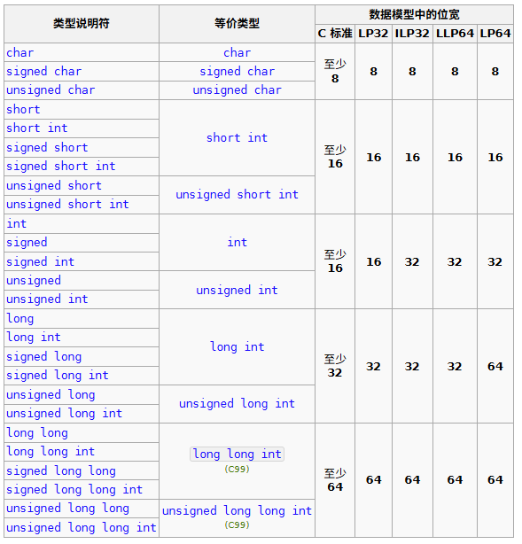
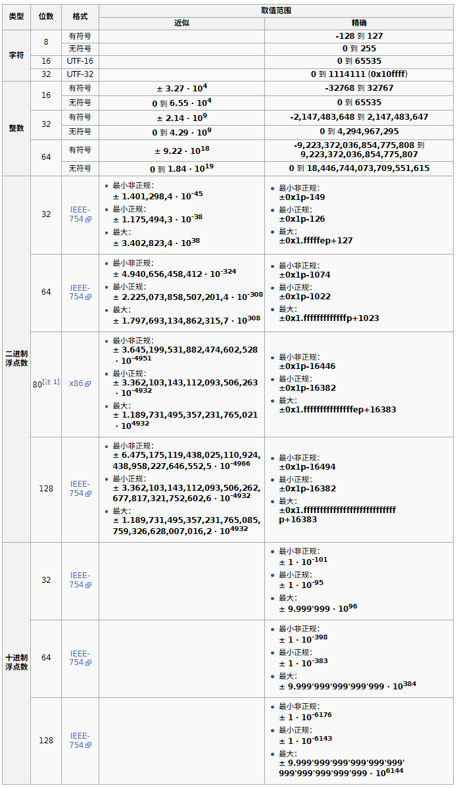

+++
title = "算术类型"
date = 2025-04-11T20:44:38+08:00
weight = 100
type = "docs"
description = ""
isCJKLanguage = true
draft = false
math = true

+++

> 原文：[https://zh.cppreference.com/w/c/language/arithmetic_types](https://zh.cppreference.com/w/c/language/arithmetic_types)

（可参阅[类型](https://zh.cppreference.com/w/c/language/types)，以获得类型系统综述，及 C 库提供的[类型相关工具列表](https://zh.cppreference.com/w/c/types)。）

## 布尔类型

- `_Bool`（亦可作为宏 [`bool`](https://zh.cppreference.com/w/c/types) 使用）(C23 前) `bool`(C23 起) — 类型，足以保有两个值之一：1 与 0（亦可作为宏 [`true`](https://zh.cppreference.com/w/c/types) 与 [`false`](https://zh.cppreference.com/w/c/types) 使用）(C23 前) `true` 和 `false` (C23 起)。- (C99 起)

> ​	注意，到 `_Bool`(C23 前) `bool`(C23 起) 的[转换](https://zh.cppreference.com/w/c/language/conversion)与到其他整数类型的转换不同：`(bool)0.5` 求值为 `true`，然而 `(int)0.5` 求值为 0。- (C99 起)


## 字符类型

- `signed char` — 用作有符号字符类型。
- `unsigned char` — 用作无符号字符类型。亦可用于查看[对象表示](https://zh.cppreference.com/w/c/language/object)（无修饰内存）。
- `char` — 用于字符类型。 与 `signed char` 或 `unsigned char` 等价（具体等价于哪个是实现定义的，并且可以通过编译器命令行开关控制），但 `char` 是独立的类型，与 `signed char` 及 `unsigned char` 都不相同。

> 注意
>
> ​	标准亦定义了 [typedef](https://zh.cppreference.com/w/c/language/typedef) 名 [`wchar_t`](https://zh.cppreference.com/w/c/string/wide)、[`char16_t`](https://zh.cppreference.com/w/c/string/multibyte) 和 [`char32_t`](https://zh.cppreference.com/w/c/string/multibyte)(C11 起) 以表示宽字符，以及表示 UTF-8 字符的 [`char8_t`](https://zh.cppreference.com/w/c/string/multibyte)(C23 起)。

## 整数类型

- `short int` （亦可用作 `short`，可以用关键词 `signed`）
- `unsigned short int` （亦可用作 `unsigned short`）
- `int` （亦可用作 signed int）这是平台的最理想整数类型，保证至少为 16 位。当前大多数平台使用 32 位（见后述的数据模型）。

- `unsigned int` （亦可用作 `unsigned`），int 的无符号对应者，实现模算术。适合位操作。
- `long int` （亦可用作 `long`）
- `unsigned long int` （亦可用作 `unsigned long`）
- `long long int` （亦可用作 `long long` ）`unsigned long long int` （亦可用作 `unsigned long long` ）(C99 起)
- `_BitInt(n)`（亦可用作 `signed _BitInt(n)`），位精确的有符号整数类型（其中 `n` 由代表精确宽度（包括符号位）的整数常量表达式替换，它不能大于 [`<limits.h>`](https://zh.cppreference.com/w/c/header/limits) 中的 `BITINT_MAXWIDTH`）`unsigned _BitInt(n)`，位精确的无符号整数类型（其中 `n` 由代表精确宽度的整数常量表达式替换，它不能大于 [`<limits.h>`](https://zh.cppreference.com/w/c/header/limits) 中的 `BITINT_MAXWIDTH`）(C23 起)

> 注意
>
> ​	同所有类型说明符，允许任意顺序： `unsigned long long int` 和 `long int unsigned long` 指名同一类型。

​	下表总结所有可用的整数类型及其属性：



​	除了最小位数， C 标准还保证

```c
1 == sizeof(char) ≤ sizeof(short) ≤ sizeof(int) ≤ sizeof(long) ≤ sizeof(long long)
```

> 注意
>
> ​	所允许的极端情形为，[字节](https://en.wikipedia.org/wiki/byte)大小为 64 位，所有类型（包括 char）均为 64 位宽，而 sizeof 对每个整数类型都返回 1。

> 注意
>
> ​	整数算术的定义对于有符号数和无符号数不同。见[算数运算符](https://zh.cppreference.com/w/c/language/operator_arithmetic)，尤其是[整数溢出](https://zh.cppreference.com/w/c/language/operator_arithmetic#.E6.BA.A2.E5.87.BA)。

## 数据模型

​	每个实现关于基础类型的大小选择被统称为*数据模型*。有四种广为接受的数据模型：

32 位系统：

- LP32 或 2/4/4 （int 为 16 位，long 与指针为 32 位）
  - Win16 API
- ILP32 或 4/4/4 （int、long 及指针为 32 位）；
  - Win32 API
  - Unix 及类 Unix 系统（Linux、Mac OS X）

64 位系统：

- LLP64 或 4/4/8 （int 及 long 为 32 位，指针为 64 位）
  - Win64 API
- LP64 或 4/8/8 （int 为 32 位，long 及指针为 64 位）
  - Unix 与类 Unix 系统（Linux、Mac OS X）


​	其他数据模型非常罕见。例如，ILP64（8/8/8：int、long 及指针均为 64 位）仅出现于某些早期 64 位 Unix 系统（例如 [Cray 上的 Unicos](https://en.wikipedia.org/wiki/UNICOS)）。

> 注意
>
> ​	从 C99 开始可从 [`<stdint.h>`](https://zh.cppreference.com/w/c/header/stdint) 中使用准确宽度的整数。

## 实浮点数类型

​	C 拥有三或六(C23 起)种表示实浮点数的类型：

- float — 单精度浮点数类型。若支持则匹配 [IEEE-754 binary32 格式](https://en.wikipedia.org/wiki/Single-precision_floating-point_format)。
- double — 双精度浮点数类型。若支持则匹配 [IEEE-754 binary64 格式](https://en.wikipedia.org/wiki/Double-precision_floating-point_format)。
- long double — 扩展精度浮点数类型。若支持则匹配 [IEEE-754 binary128 格式](https://en.wikipedia.org/wiki/Quadruple-precision_floating-point_format)，否则若支持则匹配 [IEEE-754 binary64 扩展格式](https://en.wikipedia.org/wiki/Extended_precision)，否则匹配某种精度优于 binary64 而值域至少和 binary64 一样好的非 IEEE-754 扩展浮点数格式，否则匹配 IEEE-754 binary64 格式。
  - 一些 HP-UX、 SPARC、 MIPS、 ARM64 和 z/OS 实现使用 binary128 格式。
  - 最知名的 IEEE-754 binary64 扩展格式是 80 位 x87 扩展精度格式。许多 x86 和 x86-64 实现使用它（一个典型的例外是 MSVC ，它将 long double 实现为与 double 相同的格式，即 binary64）。

​	若实现预定义宏常量 `__STDC_IEC_60559_DFP__` ，则下列十进制浮点数类型亦得到支持。

- `_Decimal32` — 表示 [IEEE-754 decimal32 格式](https://en.wikipedia.org/wiki/decimal32_floating-point_format)。(C23 起)

- `_Decimal64` — 表示 [IEEE-754 decimal64 格式](https://en.wikipedia.org/wiki/decimal64_floating-point_format)。(C23 起)

- `_Decimal128` — 表示 [IEEE-754 decimal128 格式](https://en.wikipedia.org/wiki/decimal128_floating-point_format)。(C23 起)

​	否则，不支持这些十进制浮点数类型。


​	浮点数类型可以支持特殊值：

- *无穷大*（正与负），见 [`INFINITY`](https://zh.cppreference.com/w/c/numeric/math/INFINITY)
- *负零*，-0.0。它与正零比较相等，但对于某些算术运算有意义（例如 1.0/0.0 == INFINITY，但 1.0 / -0.0 == -INFINITY）。
- *非数*（NaN），它与任何值比较不相等（包括其自身）。有多种位模式表示 NaN，见 [nan](https://zh.cppreference.com/w/c/numeric/math/nan)、[`NAN`](https://zh.cppreference.com/w/c/numeric/math/NAN)。注意 C 对（IEEE-754 所指定的）NaN 信号不作任何留意，并安静处理所有 NaN。

​	实浮点数可与[算术运算符](https://zh.cppreference.com/w/c/language/operator_arithmetic) `+` `-` `/` `*` 和来自 [`<math.h>`](https://zh.cppreference.com/w/c/header/math) 的大量数学函数一同使用。内建运算符和库函数都可能引发浮点数异常，并以 [`math_errhandling`](https://zh.cppreference.com/w/c/numeric/math/math_errhandling) 中描述的方式设置 [errno](https://zh.cppreference.com/w/c/error/errno)。

​	浮点数表达式可拥有大于其类型所指示的范围和精度，见 [FLT_EVAL_METHOD](https://zh.cppreference.com/w/c/types/limits/FLT_EVAL_METHOD)。[赋值](https://zh.cppreference.com/w/c/language/operator_assignment)、[return](https://zh.cppreference.com/w/c/language/return) 和[转型](https://zh.cppreference.com/w/c/language/cast)强制将范围和精度变成声明类型所关联者。

​	浮点数表达式亦可被*缩略*，即仿佛中间值拥有无限范围和精度一般计算，见 [`#pragma STDC FP_CONTRACT`](https://zh.cppreference.com/w/c/preprocessor/impl#.E6.A0.87.E5.87.86_pragma)。

​	一些浮点数上的运算会受到[浮点数环境](https://zh.cppreference.com/w/c/numeric/fenv)的影响，或修改它（最值得注意的是舍入方向）。

​	实浮点数类型与整数、复数和虚数类型间的[隐式转换](https://zh.cppreference.com/w/c/language/conversion)有定义。

​	附加细节、极限和浮点数类型属性见[浮点数类型极限](https://zh.cppreference.com/w/c/types/limits#.E6.B5.AE.E7.82.B9.E6.95.B0.E7.B1.BB.E5.9E.8B.E6.9E.81.E9.99.90)与 [`<math.h>`](https://zh.cppreference.com/w/c/header/math) 库。

## 复浮点数类型

​	复浮点数类型模仿数学的[复数](https://en.wikipedia.org/wiki/complex_number)，即可以写成一个实数与一个实数乘虚数单位的和的数： *a + bi*

​	三种复数类型是

- `float _Complex` （若包含 [`<complex.h>`](https://zh.cppreference.com/w/c/header/complex) 亦可用作 float [complex](http://zh.cppreference.com/w/c/numeric/complex/complex)）
- `double _Complex` （若包含 [`<complex.h>`](https://zh.cppreference.com/w/c/header/complex) 亦可用作 double [complex](http://zh.cppreference.com/w/c/numeric/complex/complex)）
- `long double _Complex` （若包含 [`<complex.h>`](https://zh.cppreference.com/w/c/header/complex) 亦可用作 long double [complex](http://zh.cppreference.com/w/c/numeric/complex/complex)）

> 注意
>
> ​	同所有类型说明符，允许任意顺序：long double [complex](http://zh.cppreference.com/w/c/numeric/complex/complex)、[complex](http://zh.cppreference.com/w/c/numeric/complex/complex) long double，甚至 double [complex](http://zh.cppreference.com/w/c/numeric/complex/complex) long 都指名同一类型。

```c
#include <complex.h>
#include <stdio.h>
 
int main(void)
{
    double complex z = 1 + 2*I;
    z = 1 / z;
    printf("1/(1.0+2.0i) = %.1f%+.1fi\n", creal(z), cimag(z));
}
```

​	输出：

```txt
1/(1.0+2.0i) = 0.2-0.4i
```

​	若实现定义了宏常量 `__STDC_NO_COMPLEX__` ，则不提供复数类型（还有库头文件 [`<complex.h>`](https://zh.cppreference.com/w/c/header/complex)）。(C11 起)

​	每个复数类型均与拥有两个对应实数类型（float 之于 float [complex](http://zh.cppreference.com/w/c/numeric/complex/complex)，double 之于 double [complex](http://zh.cppreference.com/w/c/numeric/complex/complex)，long double 之于 long double [complex](http://zh.cppreference.com/w/c/numeric/complex/complex)）元素的[数组](https://zh.cppreference.com/w/c/language/array)具有相同的[对象表示](https://zh.cppreference.com/w/c/language/object)和[对齐要求](https://zh.cppreference.com/w/c/language/object)。数组第一元素保有实部，而第二个元素保有虚部。

```c
float a[4] = {1, 2, 3, 4};
float complex z1, z2;
memcpy(&z1, a, sizeof z1); // z1 成为 1.0 + 2.0i
memcpy(&z2, a+2, sizeof z2); // z2 成为 3.0 + 4.0i
```

​	复数可用于[算术运算符](https://zh.cppreference.com/w/c/language/operator_arithmetic) `+` `-` `*` 和 `/` 使用，并可与虚数和实数混合运算。[`<complex.h>`](https://zh.cppreference.com/w/c/header/complex) 中为复数定义了许多数学函数。内建运算符和库函数都可能引发浮点数异常，并按 [`math_errhandling`](https://zh.cppreference.com/w/c/numeric/math/math_errhandling) 中描述的方式设置 [errno](https://zh.cppreference.com/w/c/error/errno)。

​	复数类型中不定义自增和自减。

​	复数类型中不定义关系运算符（没有“小于”的记号）。

本节未完成
原因：审阅其他操作、链接库

​	[隐式转换](https://zh.cppreference.com/w/c/language/conversion)定义于复数类型和其他算术类型。

​	为支持复数算术的一个无限模型， C 认可任何至少有一个无限部分的复数值为无穷大，即使另一部分是 NaN ，保证所有运算符和函数忠实于无穷大的基本属性，并提供 [cproj](https://zh.cppreference.com/w/c/numeric/complex/cproj) 以映射所有无穷大到标准的一（准确规则见[算术运算符](https://zh.cppreference.com/w/c/language/operator_arithmetic)）。

​	(C99 起)

```c
#include <complex.h>
#include <math.h>
#include <stdio.h>
 
int main(void)
{
    double complex z = (1 + 0*I) * (INFINITY + I*INFINITY);
//  教科书公式会给出
//  (1+i0)(∞+i∞) ⇒ (1×∞ – 0×∞) + i(0×∞+1×∞) ⇒ NaN + I*NaN
//  但 C 给出复无穷大
    printf("%f%+f*i\n", creal(z), cimag(z));
 
//  教科书方程会给出
//  cexp(∞+iNaN) ⇒ exp(∞)×(cis(NaN)) ⇒ NaN + I*NaN
//  但 C 给出 ±∞+i*nan
    double complex y = cexp(INFINITY + I*NAN);
    printf("%f%+f*i\n", creal(y), cimag(y));
}
```

可能的输出：

```txt
inf+inf*i 
inf+nan*i
```

​	C 也会处理多重无穷大，以在可能的地方保留方向信息，不管笛卡尔表示的固有限制：

​	实无穷大乘虚数单位，会给出对应符号的虚无穷大： i × ∞ = i∞ 。同理， i × (∞ – i∞) = ∞ + i∞ 指示合理的象限。

本节未完成 

原因：遣词

## 虚浮点数类型

​	虚浮点数类型模仿数学的[虚数](https://en.wikipedia.org/wiki/Imaginary_number)，即可以写成实数乘虚数单位的数：*bi* 三种虚数类型是

- float _Imaginary（若包含 [`<complex.h>`](https://zh.cppreference.com/w/c/header/complex) 亦可用作 float [imaginary](http://zh.cppreference.com/w/c/numeric/complex/imaginary)）
- double _Imaginary（若包含 [`<complex.h>`](https://zh.cppreference.com/w/c/header/complex) 亦可用作 double [imaginary](http://zh.cppreference.com/w/c/numeric/complex/imaginary)）
- long double _Imaginary（若包含 [`<complex.h>`](https://zh.cppreference.com/w/c/header/complex) 亦可用作 long double [imaginary](http://zh.cppreference.com/w/c/numeric/complex/imaginary)）

> 注意
>
> ​	同所有类型说明符，允许任意顺序：long double [imaginary](http://zh.cppreference.com/w/c/numeric/complex/imaginary)、[imaginary](http://zh.cppreference.com/w/c/numeric/complex/imaginary) long double，甚至 double [imaginary](http://zh.cppreference.com/w/c/numeric/complex/imaginary) long 都指名同一类型。

```c
#include <complex.h>
#include <stdio.h>
 
int main(void)
{
    double imaginary z = 3*I;
    z = 1 / z;
    printf("1/(3.0i) = %+.1fi\n", cimag(z));
}
```

输出：

```txt
1/(3.0i) = -0.3i
```

​	推荐实现定义 `__STDC_IEC_559_COMPLEX__`，但不要求支持虚数。 POSIX 推荐检查是否定义宏 [_Imaginary_I](https://zh.cppreference.com/w/c/numeric/complex/Imaginary_I) 以鉴别是否支持虚数。(C11 前)

​	若定义 `__STDC_IEC_559_COMPLEX__`(C23 前)`__STDC_IEC_60559_COMPLEX__`(C23 起)，则支持虚数。(C11 起)

​	三种虚数类型各拥有与其*对应实数类型*（float 之于 float [imaginary](http://zh.cppreference.com/w/c/numeric/complex/imaginary)，double 之于 double [imaginary](http://zh.cppreference.com/w/c/numeric/complex/imaginary)，long double 之于 long double [imaginary](http://zh.cppreference.com/w/c/numeric/complex/imaginary)）相同的[对象表示](https://zh.cppreference.com/w/c/language/object)和[对齐要求](https://zh.cppreference.com/w/c/language/object)。

> 注意
>
> ​	尽管如此，虚数类型是独立的，且与其对应实数类型[不兼容](https://zh.cppreference.com/w/c/language/types#.E5.85.BC.E5.AE.B9.E7.B1.BB.E5.9E.8B)，这禁止别名使用。

​	虚数可用于 [算术运算符](https://zh.cppreference.com/w/c/language/operator_arithmetic) `+` `-` `*` 及 `/`，并且可与复数和实数混用。[`<complex.h>`](https://zh.cppreference.com/w/c/header/complex) 中为虚数类型定义多个数学函数。内建运算符和库函数都可能引发浮点数异常，并按描述于 [`math_errhandling`](https://zh.cppreference.com/w/c/numeric/math/math_errhandling) 的方式设置 [errno](https://zh.cppreference.com/w/c/error/errno)。

​	自增和自减不定义于虚数类型。

本节未完成
原因：审阅其他操作、链接库

​	[隐式转换](https://zh.cppreference.com/w/c/language/conversion)定义于虚数类型和其他算术类型之间。

​	虚数类型零通过自然记号 x + I*y（其中 I 定义为 [_Imaginary_I](https://zh.cppreference.com/w/c/numeric/complex/Imaginary_I)）表示所有复数成为可能。若无虚数类型，则无法自然地创建一些特殊复数值。例如，若 I 被定义为 [_Complex_I](https://zh.cppreference.com/w/c/numeric/complex/Complex_I)，则书写 0.0 + I*INFINITY 会给出有 NaN 实部的结果，而必须用 [CMPLX](http://zh.cppreference.com/w/c/numeric/complex/CMPLX)(0.0, INFINITY) 替代之。拥有负零虚部的数亦然，这对于使用存在分支的库函数有意义，例如 [csqrt](https://zh.cppreference.com/w/c/numeric/complex/csqrt)：若 I 定义为 [_Complex_I](https://zh.cppreference.com/w/c/numeric/complex/Complex_I)，则 1.0 - 0.0*I 结果有正零的虚部，并要求用 [CMPLX](https://zh.cppreference.com/w/c/numeric/complex/CMPLX) 或 [conj](https://zh.cppreference.com/w/c/numeric/complex/conj) 获得负零虚部。

​	虚数类型亦会简化实现：若支持虚数则复数乘虚数可以直接实现为二次乘法，而非四次乘法和二次加法。

## 关键词

- [`bool`](https://zh.cppreference.com/w/c/keyword/bool), [`true`](https://zh.cppreference.com/w/c/keyword/true), [`false`](https://zh.cppreference.com/w/c/keyword/false), [`char`](https://zh.cppreference.com/w/c/keyword/char), [`int`](https://zh.cppreference.com/w/c/keyword/int), [`short`](https://zh.cppreference.com/w/c/keyword/short), [`long`](https://zh.cppreference.com/w/c/keyword/long), [`signed`](https://zh.cppreference.com/w/c/keyword/signed), [`unsigned`](https://zh.cppreference.com/w/c/keyword/unsigned), [`float`](https://zh.cppreference.com/w/c/keyword/float), [`double`](https://zh.cppreference.com/w/c/keyword/double).
- [`_Bool`](https://zh.cppreference.com/w/c/keyword/_Bool), [`_BitInt`](https://zh.cppreference.com/mwiki/index.php?title=c/keyword/_BitInt&action=edit&redlink=1), [`_Complex`](https://zh.cppreference.com/w/c/keyword/_Complex), [`_Imaginary`](https://zh.cppreference.com/w/c/keyword/_Imaginary), [`_Decimal32`](https://zh.cppreference.com/w/c/keyword/_Decimal32), [`_Decimal64`](https://zh.cppreference.com/w/c/keyword/_Decimal64), [`_Decimal128`](https://zh.cppreference.com/w/c/keyword/_Decimal128).

## 取值范围

​	下表提供常用数值表示的界限的参考。

​	C23 之前，C 标准曾允许任意的有符号整数表示，而 N 位有符号整数的最小保证范围为从 \\(−(2^{N−1}−1)\\) 到 \\(+2^{N−1}−1\\) （例如有符号 8 位类型为 -127 到 127 ），这对应于[反码](https://en.wikipedia.org/wiki/one's_complement)或[原码](https://en.wikipedia.org/wiki/signed_number_representations#Sign-and-magnitude_method)的界限。

​	然而，所有通行数据模型（含 ILP32、LP32、LP64、LLP64 全体）和几乎所有的 C 编译器（已知的仅有例外是 UNISYS 的一些编译器）均使用[补码](https://en.wikipedia.org/wiki/Two's_complement)表示，而从 C23 起，这是标准所允许的唯一表示，所保证的范围为从\\(−(2^{N−1}−1)\\) 到 \\(+2^{N−1}−1\\) （例如有符号 8 位类型为 -128 到 127）。



1. [↑](https://zh.cppreference.com/w/c/language/arithmetic_types#cite_ref-1) 在 `32/64` 位平台上对象表示通常占用 `96/128` 位。

> 注意
>
> ​	实际（与保证最小值相对）的范围可在库头文件 [`<limits.h>`](https://zh.cppreference.com/w/c/header/limits) 和 [`<float.h>`](https://zh.cppreference.com/w/c/header/float) 中获得。

## 参阅

基础类型的 [C++ 文档](https://zh.cppreference.com/w/cpp/language/types)