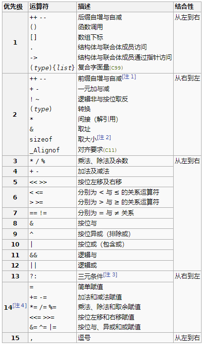

+++
title = "C 运算符优先级"
date = 2025-04-12T20:37:24+08:00
weight = 140
type = "docs"
description = ""
isCJKLanguage = true
draft = false

+++

> 原文：[https://zh.cppreference.com/w/c/language/operator_precedence](https://zh.cppreference.com/w/c/language/operator_precedence)

​	下表列出 C 运算符的优先级和结合性。运算符从上到下以降序列出。

1. [↑]() 前缀 `++` 与 `--` 的运算数不能是转换。此规则在文法上禁止某些表达式本来也会在语义上非法的表达式。某些编译器忽略此规则并检测语义上的非法。
2. [↑]() `sizeof` 的运算数不能是转换：表达式 `sizeof (int) * p` 无歧义地转译成 `(sizeof(int)) * p` ，而非 `sizeof((int)*p)` 。
3. [↑]() 条件运算符中部（`?` 与 `:` 之间）的表达式分析为如同加括号：忽略其相对于 `?:` 的优先级。
4. [↑]() 赋值运算符的左运算数必须是一元（第 2 级非转换）表达式。此规则在文法上禁止某些表达式本来也会在语义上非法的表达式。从而许多编译器忽略此规则并在语义上检测其非法。例如， `e = a < d ? a++ : a = d` 是因此规则而无法剖析的表达式。然而许多编译器忽略此规则并将它剖析成 `e = ( ((a < d) ? (a++) : a) = d )`，并给出错误，因为它在语义上非法。

​	分析表达式时，列于上面表中某行的运算符，将比列于低于它的行中拥有较低优先级的任何运算符，更紧密地绑定到其参数（如同用括号）。例如，表达式 `*p++` 被分析为 `*(p++)`，而非 `(*p)++`。

​	拥有相同优先级的运算符以其结合性的方向绑定到其参数。例如表达式 `a=b=c` 被分析为 `a=(b=c)` 而非 `(a=b)=c`，因为从右到左结合性。

## 注解

​	优先级和结合性与[求值顺序]()相互独立。

​	标准自身并未指定优先级。它们是从文法中导出的。

​	C++ 中，条件运算符拥有与赋值运算符相同的优先级，而前缀 `++` 与 `--` 及赋值运算符无关于其运算数的限制。

​	结合性规定对于一元运算符是冗余的，且只为完备而显示：一元前缀运算符始终从右到左结合（`sizeof ++*p` 为 `sizeof(++(*p))`）而一元后缀运算符始终从左到右结合`（a[1][2]++ 为 ((a[1])[2])++）`。注意结合性对成员访问运算符有意义，即使在它们与一元后缀运算符组合时：`a.b++` 分析为 `(a.b)++` 而非 `a.(b++)`。

## 参阅

C++ 运算符优先级的 [C++ 文档](https://zh.cppreference.com/w/cpp/language/operator_precedence)
