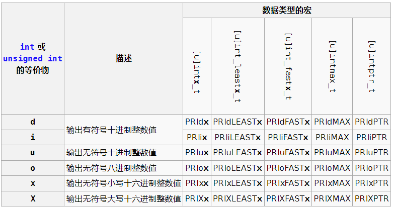
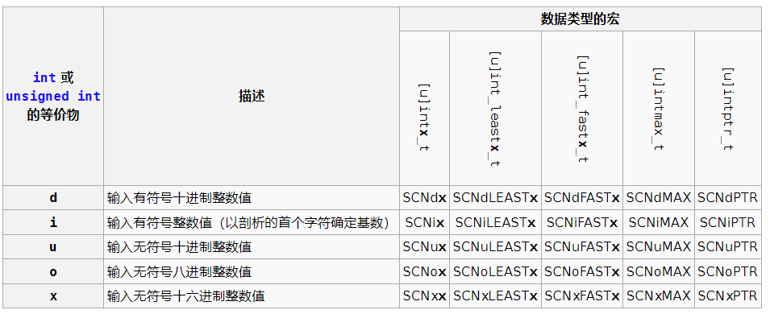

+++
title = "定宽整数类型 (C99 起)"
date = 2025-04-14T16:05:07+08:00
weight = 80
type = "docs"
description = ""
isCJKLanguage = true
draft = false

+++

> 原文：[https://zh.cppreference.com/w/c/types/integer](https://zh.cppreference.com/w/c/types/integer)

## 类型

| 在标头 `<stdint.h>` 定义                                     |                                                              |
| ------------------------------------------------------------ | ------------------------------------------------------------ |
| `int8_t` <br />`int16_t` <br />`int32_t` <br />`int64_t`     | 分别是宽度正好是 8、16、32 和 64 位的有符号整数类型 无填充位并对负值使用补码 （只有在实现直接支持该类型时才会提供） |
| `int_fast8_t` <br />`int_fast16_t` <br />`int_fast32_t` <br />`int_fast64_t` | 分别是宽度至少有 8、16、32 和 64 位的最快的有符号整数类型    |
| `int_least8_t` <br />`int_least16_t` <br />`int_least32_t` <br />`int_least64_t` | 分别是宽度至少有 8、16、32 和 64 位的最小的有符号整数类型    |
| `intmax_t`                                                   | 最大宽度的有符号整数类型                                     |
| `intptr_t`                                                   | 足以保有指针的整数类型                                       |
| `uint8_t` <br />`uint16_t` <br />`uint32_t` <br />`uint64_t` | 分别是宽度正好是 8、16、32 和 64 位的无符号整数类型 （只有在实现直接支持该类型时才会提供） |
| `uint_fast8_t` <br />`uint_fast16_t` <br />`uint_fast32_t` <br />`uint_fast64_t` | 分别是宽度至少有 8、16、32 和 64 位的最快的无符号整数类型    |
| `uint_least8_t` <br />`uint_least16_t` <br />`uint_least32_t` <br />`uint_least64_t` | 分别是宽度至少有 8、16、32 和 64 位的最小的无符号整数类型    |
| `uintmax_t`                                                  | 最大宽度的无符号整数类型                                     |
| `uintptr_t`                                                  | 足以保有指针的无符号整数类型                                 |

​	实现可在 N 不是 8、 16、 32 或 64 时定义 typedef 名 `intN_t`、`int_fastN_t`、`int_leastN_t`、`uintN_t`、`uint_fastN_t` 及 `uint_leastN_t`。形为 `intN_t` 的 typedef 名，可能仅当实现支持有该宽度而无填充的整数类型才得以定义。因此，uint24_t 代表宽度严格为 24 位的无符号整数类型。

​	下面列出的每个宏当且仅当实现定义对应的 typedef 名时才得以定义。宏 `INTN_C` 与 `UINTN_C` 分别对应 typedef 名 `int_leastN_t` 与 `uint_leastN_t`。

## 宏常量

| 在标头 `<stdint.h>` 定义 |
| -------------------------- |

### 有符号整数：宽度

| INT8_WIDTH (C23)(可选)<br />INT16_WIDTH (C23)<br />INT32_WIDTH (可选)<br />INT64_WIDTH<br /> | int8_t、int16_t、int32_t、int64_t 类型对象的位宽（恰好为 8、16、32、64） (宏常量) |
| ------------------------------------------------------------ | ------------------------------------------------------------ |
| INT_FAST8_WIDTH (C23)<br />INT_FAST16_WIDTH (C23)<br />INT_FAST32_WIDTH<br />INT_FAST64_WIDTH<br /> | int_fast8_t、int_fast16_t、int_fast32_t、int_fast64_t 类型对象的位宽 (宏常量) |
| INT_LEAST8_WIDTH (C23)<br />INT_LEAST16_WIDTH (C23)<br />INT_LEAST32_WIDTH<br />INT_LEAST64_WIDTH<br /> | int_least8_t、int_least16_t、int_least32_t、int_least64_t 类型对象的位宽 (宏常量) |
| INTPTR_WIDTH (C23)(可选)<br />                               | intptr_t 类型对象的位宽 (宏常量)                             |
| INTMAX_WIDTH (C23)<br />                                     | intmax_t 类型对象的位宽 (宏常量)                             |

### 有符号整数：最小值

| INT8_MIN<br />INT16_MIN<br />INT32_MIN<br />INT64_MIN<br />  | int8_t、int16_t、int32_t、int64_t 类型对象的最小值 (宏常量)  |
| ------------------------------------------------------------ | ------------------------------------------------------------ |
| INT_FAST8_MIN<br />INT_FAST16_MIN<br />INT_FAST32_MIN<br />INT_FAST64_MIN<br /> | int_fast8_t、int_fast16_t、int_fast32_t、int_fast64_t 类型对象的最小值 (宏常量) |
| INT_LEAST8_MIN<br />INT_LEAST16_MIN<br />INT_LEAST32_MIN<br />INT_LEAST64_MIN<br /> | int_least8_t、int_least16_t、int_least32_t、int_least64_t 类型对象的最小值 (宏常量) |
| INTPTR_MIN<br />                                             | intptr_t 类型对象的最小值 (宏常量)                           |
| INTMAX_MIN<br />                                             | intmax_t 类型对象的最小值 (宏常量)                           |

### 有符号整数：最大值

| INT8_MAX<br />INT16_MAX<br />INT32_MAX<br />INT64_MAX<br />  | int8_t、int16_t、int32_t、int64_t 类型对象的最大值 (宏常量)  |
| ------------------------------------------------------------ | ------------------------------------------------------------ |
| INT_FAST8_MAX<br />INT_FAST16_MAX<br />INT_FAST32_MAX<br />INT_FAST64_MAX<br /> | int_fast8_t、int_fast16_t、int_fast32_t、int_fast64_t 类型对象的最大值 (宏常量) |
| INT_LEAST8_MAX<br />INT_LEAST16_MAX<br />INT_LEAST32_MAX<br />INT_LEAST64_MAX<br /> | int_least8_t、int_least16_t、int_least32_t、int_least64_t 类型对象的最大值 (宏常量) |
| INTPTR_MAX<br />                                             | intptr_t 类型对象的最大值 (宏常量)                           |
| INTMAX_MAX<br />                                             | intmax_t 类型对象的最大值 (宏常量)                           |

### 无符号整数：宽度

| UINT8_WIDTH (C23)(可选)<br />UINT16_WIDTH (C23)<br />UINT32_WIDTH (可选)<br />UINT64_WIDTH<br /> | uint8_t、uint16_t、uint32_t、uint64_t 类型对象的位宽（恰好为 8、16、32、64） (宏常量) |
| ------------------------------------------------------------ | ------------------------------------------------------------ |
| UINT_FAST8_WIDTH (C23)<br />UINT_FAST16_WIDTH (C23)<br />UINT_FAST32_WIDTH<br />UINT_FAST64_WIDTH<br /> | uint_fast8_t、uint_fast16_t、uint_fast32_t、uint_fast64_t 类型对象的位宽 (宏常量) |
| UINT_LEAST8_WIDTH (C23)<br />UINT_LEAST16_WIDTH (C23)<br />UINT_LEAST32_WIDTH<br />UINT_LEAST64_WIDTH<br /> | uint_least8_t、uint_least16_t、uint_least32_t、uint_least64_t 类型对象的位宽 (宏常量) |
| UINTPTR_WIDTH (C23)(可选)<br />                              | uintptr_t 类型对象的位宽 (宏常量)                            |
| UINTMAX_WIDTH (C23)<br />                                    | uintmax_t 类型对象的位宽 (宏常量)                            |

### 无符号整数：最大值

| UINT8_MAX<br />UINT16_MAX<br />UINT32_MAX<br />UINT64_MAX<br /> | uint8_t、uint16_t、uint32_t、uint64_t 类型对象的最大值 (宏常量) |
| ------------------------------------------------------------ | ------------------------------------------------------------ |
| UINT_FAST8_MAX<br />UINT_FAST16_MAX<br />UINT_FAST32_MAX<br />UINT_FAST64_MAX<br /> | uint_fast8_t、uint_fast16_t、uint_fast32_t、uint_fast64_t 类型对象的最大值 (宏常量) |
| UINT_LEAST8_MAX<br />UINT_LEAST16_MAX<br />UINT_LEAST32_MAX<br />UINT_LEAST64_MAX<br /> | uint_least8_t、uint_least16_t、uint_least32_t、uint_least64_t 类型对象的最大值 (宏常量) |
| UINTPTR_MAX<br />                                            | uintptr_t 类型对象的最大值 (宏常量)                          |
| UINTMAX_MAX<br />                                            | uintmax_t 类型对象的最大值 (宏常量)                          |

## 最小宽度整数常量的函数宏

| INT8_C<br />INT16_C<br />INT32_C<br />INT64_C<br />     | 展开成拥有以其实参指定的值的整数常量表达式，其类型分别为 int_least8_t、int_least16_t、int_least32_t、int_least64_t (宏函数) |
| ------------------------------------------------------- | ------------------------------------------------------------ |
| INTMAX_C<br />                                          | 展开成拥有以其实参指定的值的整数常量表达式，其类型为 intmax_t (宏函数) |
| UINT8_C<br />UINT16_C<br />UINT32_C<br />UINT64_C<br /> | 展开成拥有以其实参指定的值的整数常量表达式，其类型分别为 uint_least8_t、uint_least16_t、uint_least32_t、uint_least64_t (宏函数) |
| UINTMAX_C<br />                                         | 展开成拥有以其实参指定的值的整数常量表达式，其类型为 uintmax_t (宏函数) |

```c
#include <stdint.h>
UINT64_C(0x123) // 可能展开成 0x123ULL 或 0x123UL
```

## 格式宏常量

​	在标头 `<inttypes.h>` 定义

### fprintf系列函数的格式常量

[fprintf](https://zh.cppreference.com/w/c/io/fprintf) 系列函数的格式常量

​	此处列出的每个 `PRI` 宏当且仅当实现定义对应的 typedef 名才得以定义。



### fscanf系列函数的格式常量

[fscanf](https://zh.cppreference.com/w/c/io/fscanf) 系列函数的格式常量

​	此处列出的每个 `SCN` 宏当且仅当实现定义对应的 typedef 名且拥有适合该类型的 [fscanf](https://zh.cppreference.com/w/c/io/fscanf) 长度修饰符才得以定义。



## 示例

​	有关本示例中使用的[格式宏]()，另请参见 [C++ 兼容性注解](https://zh.cppreference.com/w/cpp/language/user_literal#.E6.B3.A8.E8.A7.A3)

```c
#include <inttypes.h>
#include <stdio.h>
 
int main(void)
{
    printf("%zu\n", sizeof(int64_t));
    printf("%s\n", PRId64);
    printf("%+" PRId64 "\n", INT64_MIN);
    printf("%+" PRId64 "\n", INT64_MAX);
 
    int64_t n = 7;
    printf("%+" PRId64 "\n", n);
}
```

​	可能的输出：

```txt
8
lld
-9223372036854775808
+9223372036854775807
+7
```

### 参阅

- [算术类型]()

| 定宽整数类型的 [C++ 文档](https://zh.cppreference.com/w/cpp/types/integer) |
| ------------------------------------------------------------ |
| 用户定义字面量 ([格式化宏注解](https://zh.cppreference.com/w/cpp/language/user_literal#.E6.B3.A8.E8.A7.A3))的 [C++ 文档](https://zh.cppreference.com/w/cpp/language/user_literal) |
