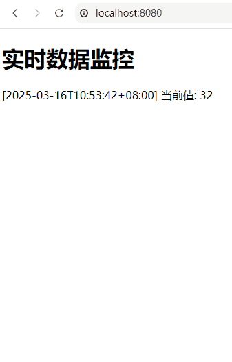

+++

title = "gin"
date = 2025-03-12T12:59:19+08:00
weight = 1
type = "docs"
description = ""
isCJKLanguage = true
draft = false

+++

https://app.studyraid.com/en/read/5926/130176/built-in-middleware

## 是什么？

​	[Gin](https://github.com/gin-gonic/gin) 是一个用Go语言编写的`Web框架`，以高性能和简洁著称，类似于 Martini，但性能更高。

​	[httprouter](https://github.com/julienschmidt/httprouter) 采用 **Radix Tree（基数树）** 进行高效的路由匹配，其查找复杂度趋近于 **O(k)**（k 为 URL 片段数），相比于传统的 O(m) 线性遍历匹配更高效。Gin 基于 `net/http`并借鉴了 `httprouter` 的路由设计，自行实现了高性能的路由匹配机制，同时通过高效的 JSON 解析、零内存拷贝优化、减少 GC 压力等方式，进一步提升了整体性能，使其在高并发场景下具有优异表现。`Gin`和`httprouter`本质上都是通过减少路由查找的时间复杂度来实现的。

​	此外，Gin 还提供了诸如中间件支持、渲染、数据绑定与校验等功能，使其适用于快速开发`RESTful API`和高性能Web服务。这种设计使得 Gin 在保持高性能的同时，扩展性更强。

> URL 片段数
>
> 假设有如下几个 URL 路由规则：
>
> ```sh
> /users/:id
> /users/:id/profile
> /articles/:category/:id
> ```
>
> 如果匹配 `"/users/123/profile"`，那么 **片段数（k）** 是：
>
> - `"users"` → **第 1 段**
> - `"123"` → **第 2 段**（动态参数 `:id`）
> - `"profile"` → **第 3 段**
>
> 所以，`k = 3`。
>
> ​	**片段数（k）** 指 URL 通过 `/` 分割后的部分数量。

> **Radix Tree（基数树）简介**
>
> ​	**Radix Tree（基数树）**，又称 **压缩前缀树（Compressed Prefix Tree）**，是一种 **改进的 Trie（字典树）数据结构**，用于高效存储和检索字符串数据。它通过合并公共前缀路径，减少节点数量，从而提高查询效率和节省存储空间。
>
> ------
>
> **1. Radix Tree 的基本特点**
>
> - **基于前缀匹配**：存储时会合并具有相同前缀的路径，从而减少树的深度。
> - **减少节点数量**：相比于普通的 Trie（每个字符一个节点），Radix Tree **一个节点可以存储多个字符**，从而减少冗余。
> - **适用于高效字符串查找**：如 **路由匹配**、**IP 路由表**、**字符串存储**（如 DNS、自动补全）等应用场景。
> - **查询时间复杂度通常趋近于 `O(k)`**（k 为查询字符串的片段数或字符数，取决于具体实现）。
>
> ------
>
> **2. 普通 Trie vs. Radix Tree 对比**
>
> **示例数据集（存储以下 URL 路由）：**
>
> ```sh
> /user
> /user/profile
> /user/settings
> /useful
> ```
>
> **（1）普通 Trie 结构**
>
> 普通的 Trie（前缀树）会逐字符存储：
>
> ```sh
>       /
>       ├── u
>       │   ├── s
>       │   │   ├── e
>       │   │   │   ├── r
>       │   │   │   │   ├── / (终结)
>       │   │   │   │   ├── p
>       │   │   │   │   │   ├── r
>       │   │   │   │   │   ├── o
>       │   │   │   │   │   ├── f
>       │   │   │   │   │   ├── i
>       │   │   │   │   │   ├── l
>       │   │   │   │   │   ├── e (终结)
>       │   │   │   │   ├── s
>       │   │   │   │   │   ├── e
>       │   │   │   │   │   ├── t
>       │   │   │   │   │   ├── t
>       │   │   │   │   │   ├── i
>       │   │   │   │   │   ├── n
>       │   │   │   │   │   ├── g
>       │   │   │   │   │   ├── s (终结)
>       │   │   │   ├── f
>       │   │   │   ├── u
>       │   │   │   ├── l (终结)
> ```
>
> - **问题**：每个字符都独占一个节点，存储效率低，路径过长。
>
> ------
>
> **（2）Radix Tree 结构**
>
> Radix Tree 通过 **合并公共前缀**，减少节点数：
>
> ```sh
> 	  /
>       ├── user
>       │   ├── / (终结)
>       │   ├── profile (终结)
>       │   ├── settings (终结)
>       ├── useful (终结)
> ```
>
> - 优势：
>   - **减少节点数量**，`/user` 直接作为一个节点，不需要按字符存储。
>   - **加快查询速度**，不需要逐字符遍历，只需按前缀片段匹配。
>
> ------
>
> **3. 为什么 Gin 使用 Radix Tree？**
>
> ​	Gin 的路由匹配采用 **Radix Tree**，相比传统线性匹配（O(m)），它可以更快地匹配 URL 路由，适用于高并发场景。
>
> **Gin 的路由存储示例**
>
> ​	假设注册以下路由：
>
> ```sh
> /users
> /users/:id
> /users/:id/profile
> /articles/:category/:id
> ```
>
> **Radix Tree 存储结构：**
>
> ```sh
>       /
>       ├── users
>       │   ├── / (终结)
>       │   ├── :id
>       │   │   ├── /profile (终结)
>       ├── articles
>       │   ├── :category
>       │   │   ├── :id (终结)
> ```
>
> - 查询 `/users/123/profile`：
>   1. 从根 `/` 开始匹配 `users`。
>   2. 进入 `:id` 节点（匹配 `123`）。
>   3. 进入 `/profile` 节点，成功匹配。
>
> ------
>
> **4. 总结**
>
> - **Radix Tree 通过合并前缀减少存储空间，提高匹配效率。**
> - **Gin 使用 Radix Tree 来优化 URL 路由匹配，提升查询速度。**
> - **查询时间复杂度通常为 `O(k)`，相比于传统 `O(m)` 线性遍历方式更高效。**

## 有什么用？

​	Gin 主要用于：

- **构建 Web 应用**：支持 HTTP 路由、静态文件托管和模板渲染。
- **构建 RESTful API**：轻量级、性能优越，适用于微服务架构。
- **高效处理请求**：提供高性能的 JSON 解析、数据绑定、日志记录和错误处理机制。
- **中间件支持**：支持用户自定义中间件，如身份验证、日志、跨域等。

## 创建gin实例化对象

​	Gin 提供两种方式创建实例化对象：

1. `gin.Default()`：创建一个默认的路由引擎，包含 `Logger` 和 `Recovery` 中间件。
2. `gin.New()`：创建一个不包含任何默认中间件的路由引擎。

```go

```


## 路由

​	在 Gin 框架中，**路由（Routing）** 是指 **将客户端的 HTTP 请求路径（URL）与相应的处理函数（Handler）进行映射**，从而实现不同的请求逻辑。

### 定义路由

#### （1）基于 HTTP 方法定义路由

​	Gin 提供了 **常见的 HTTP 方法**（`GET`、`POST`、`PUT`、`DELETE`、`PATCH`、`HEAD`、`OPTIONS` ）等7个（除了`TRACE`和`CONNECT`），用于定义路由，每个方法都对应 `gin.Engine` 的一个方法：

```go
package main

import "github.com/gin-gonic/gin"

func main() {
    r := gin.Default()

    r.GET("/get", func(c *gin.Context) {
        c.String(200, "GET Request")
    })

    r.POST("/post", func(c *gin.Context) {
        c.String(200, "POST Request")
    })

    r.PUT("/put", func(c *gin.Context) {
        c.String(200, "PUT Request")
    })

    r.DELETE("/delete", func(c *gin.Context) {
        c.String(200, "DELETE Request")
    })

    r.PATCH("/patch", func(c *gin.Context) {
        c.String(200, "PATCH Request")
    })

    r.HEAD("/head", func(c *gin.Context) {
        c.String(200, "HEAD Request")
    })

    r.OPTIONS("/options", func(c *gin.Context) {
        c.String(200, "OPTIONS Request")
    })

    r.Run() // 监听 0.0.0.0:8080
}
```

```powershell
PS D:\GoPrjs2\ginDemo> curl -X GET http://localhost:8080/get                         
GET Request
PS D:\GoPrjs2\ginDemo> curl -X POST http://localhost:8080/post                       
POST Request
PS D:\GoPrjs2\ginDemo> curl -X PUT http://localhost:8080/put  
PUT Request
PS D:\GoPrjs2\ginDemo> curl -X PUT http://localhost:8080/PUT
404 page not found
PS D:\GoPrjs2\ginDemo> curl -X DELETE http://localhost:8080/delete
DELETE Request
PS D:\GoPrjs2\ginDemo> curl -X PATCH http://localhost:8080/patch  
PATCH Request
PS D:\GoPrjs2\ginDemo> curl -X HEAD http://localhost:8080/head  
Warning: Setting custom HTTP method to HEAD with -X/--request may not work the way you want. Consider using -I/--head instead.
PS D:\GoPrjs2\ginDemo> curl -I  http://localhost:8080/head          
HTTP/1.1 200 OK
Content-Type: text/plain; charset=utf-8
Date: Thu, 13 Mar 2025 11:36:26 GMT
Content-Length: 12

PS D:\GoPrjs2\ginDemo> curl -X OPTIONS http://localhost:8080/options
OPTIONS Request
```

> **为什么不使用 `curl -X HEAD`？**
>
> ​	`-I`（即 `--head`）表示发送 **HEAD 请求**，且 `curl` 知道不需要 body，不会有异常行为。`curl -X HEAD` 只是强制将请求方法设为 `HEAD`，但 **默认情况下 `curl` 仍然尝试显示响应体（body）**。然而，`HEAD` 请求本身不会返回 body，所以 `curl` 可能无法正确处理，导致 **不显示任何结果**。

**特点：**

- **最常用的方式**，直接通过 `HTTP方法` 定义路由，适用于大多数 API 设计场景。

#### （2）使用 `Any()` 处理所有 HTTP 方法

​	`Any()` 方法可以让 **同一路由支持所有的 HTTP 请求方法**（`GET`、`POST`、`PUT`、`DELETE`、`PATCH`、`HEAD`、`OPTIONS` 等）。

```go
package main

import "github.com/gin-gonic/gin"

func main() {
	r := gin.Default()

	r.Any("/any", func(c *gin.Context) {
		c.String(200, "This is an Any Route, HTTP Method: %s", c.Request.Method)
	})

	r.Run() // 监听 0.0.0.0:8080
}
```

```powershell
PS D:\GoPrjs2\ginDemo> curl -X GET http://localhost:8080/any        
This is an Any Route, HTTP Method: GET
PS D:\GoPrjs2\ginDemo> curl -X POST http://localhost:8080/any
This is an Any Route, HTTP Method: POST
PS D:\GoPrjs2\ginDemo> curl -X PUT http://localhost:8080/any 
This is an Any Route, HTTP Method: PUT
...
```

特点：

- **适用于调试**，如果你想让一个路径对所有请求方式都生效，可以使用 `Any()` 。
- **不建议用于生产 API 设计**，通常应按具体的 HTTP 方法区分业务逻辑

#### （3）使用 `NoRoute()` 处理未匹配的路由

​	当客户端访问 **未定义的路由** 时，Gin 提供 `NoRoute()` 方法用于**自定义 404 处理逻辑**。

```go
package main

import "github.com/gin-gonic/gin"

func main() {
	r := gin.Default()

	r.Any("/any", func(c *gin.Context) {
		c.String(200, "This is an Any Route, HTTP Method: %s", c.Request.Method)
	})

	r.NoRoute(func(c *gin.Context) {
		c.JSON(404, gin.H{
			"message": "Route Not Found",
		})
	})

	r.Run() // 监听 0.0.0.0:8080
}
```

```powershell
PS D:\GoPrjs2\ginDemo> curl -X GET http://localhost:8080/any
This is an Any Route, HTTP Method: GET
PS D:\GoPrjs2\ginDemo> curl -X GET http://localhost:8080/nothing
{"message":"Route Not Found"}

```

**特点：**

- **适用于全局 404 处理**，增强 API 友好性。

### 定义路由变量

（1）冒号语法（如 `/user/:id`）捕获单个路径段；

（2）通配符语法（如 `/user/:name/*action`）捕获剩余路径（包含`*`前面的`/`）。

```go
r.v("/user/:id", func(c *gin.Context) { 
    id := c.Param("id"); 
    c.String(200, "User ID: " + id) 
})

```

​	当访问 `/user/123` 时，`:id` 捕获 `123`，并可通过 `c.Param("id")` 获取对应值。

```go
r.GET("/user/:name/*action", func(c *gin.Context) { 
    name := c.Param("name"); 
    action := c.Param("action"); 
    c.String(200, name + " is " + action) 
})
```

​	

```powershell
PS D:\GoPrjs2\ginDemo> curl http://localhost:8080/user/john/talking                                                                           
john is /talking
PS D:\GoPrjs2\ginDemo> curl http://localhost:8080/user/john
<a href="/user/john/">Moved Permanently</a>.

PS D:\GoPrjs2\ginDemo> curl http://localhost:8080/user
404 page not found
```


| 特性         | 冒号语法 `:param`      | 通配符语法 `*param`      |
| ------------ | ---------------------- | ------------------------ |
| **匹配范围** | 单个路径段（不含斜杠） | 剩余所有路径（可含斜杠） |
| **位置限制** | 可出现在路径中间       | 必须位于路由末尾         |
| **参数内容** | 纯字符串（无 `/`）     | 可包含 `/` 的路径字符串  |

### 路由到静态资源


| **方式**            | **方法**                                | **描述**                              | **示例**                                                     |
| ------------------- | --------------------------------------- | ------------------------------------- | ------------------------------------------------------------ |
| 内置方法 - 目录     | `router.Static(prefix, root)`           | 服务目录下所有文件，通过前缀 URL 访问 | `router.Static("/static", "./public")`                       |
| 内置方法 - 文件系统 | `router.StaticFS(prefix, fs)`           | 服务自定义文件系统，通过前缀 URL 访问 | `router.StaticFS("/more_static", http.Dir("my_file_system"))` |
| 内置方法 - 单文件   | `router.StaticFile(url, filepath)`      | 服务单个文件，映射到特定 URL          | `router.StaticFile("/favicon.ico", "./resources/favicon.ico")` |
| 第三方库            | `github.com/gin-contrib/static`         | 提供中间件，支持目录索引、嵌入文件等  | `r.Use(static.Serve("/", static.LocalFile("/tmp", true)))`   |
| 手动处理            | `c.File(filepath)` 或 `http.FileServer` | 自定义处理静态文件请求                | `r.Any("/*path", func(c *gin.Context) { c.File("./public/" + c.Param("path")) })` |

#### `router.Static(prefix, root)`

```go
package main

import (
	"github.com/gin-gonic/gin"
)

func main() {
	r := gin.Default()

	// 将本地 ./static 目录映射到 URL 路径 /assets
	r.Static("/assets", "./static")

	r.GET("/", func(c *gin.Context) {
		c.String(200, "访问静态资源请使用 /assets/filename")
	})

	r.Run(":8080")
}
```

​	文件结构：

```sh
project/
│── main.go
│── static/
│   ├── hello.txt
│   ├── image.png
│   ├── css/
│   │   ├── style.css
│   ├── js/
│   │   ├── script.js
```


```powershell
PS D:\GoPrjs2\ginDemo> curl  http://localhost:8080/assets/css/style.css
* {
    padding: 10px;
}
PS D:\GoPrjs2\ginDemo> curl  http://localhost:8080/assets/js/script.js 
console.log("This is my code.")
PS D:\GoPrjs2\ginDemo> curl  http://localhost:8080/assets/hello.txt   
This is hello.txt's content.
PS D:\GoPrjs2\ginDemo> curl  http://localhost:8080/assets/nothing
PS D:\GoPrjs2\ginDemo> curl  http://localhost:8080/assets/nothing -v
* Host localhost:8080 was resolved.
* IPv6: ::1
* IPv4: 127.0.0.1
*   Trying [::1]:8080...
* Connected to localhost (::1) port 8080
* using HTTP/1.x
> GET /assets/nothing HTTP/1.1
> Host: localhost:8080
> User-Agent: curl/8.10.1
> Accept: */*
>
< HTTP/1.1 404 Not Found
< Date: Thu, 13 Mar 2025 12:20:56 GMT
< Content-Length: 0
<
* Connection #0 to host localhost left intact

```


#### router.StaticFS(prefix, fs)

##### 示例1：使用本地文件系统

```go
package main

import (
	"github.com/gin-gonic/gin"
	"net/http"
)

func main() {
	r := gin.Default()

	// 使用 http.Dir 作为文件系统，将 `./static` 目录映射到 `/assets`
	r.StaticFS("/assets", http.Dir("./static"))

	r.GET("/", func(c *gin.Context) {
		c.String(200, "访问静态资源请使用 /assets/filename")
	})

	r.Run(":8080")
}

```

```powershell
PS D:\GoPrjs2\ginDemo> curl  http://localhost:8080/assets/hello.txt
This is hello.txt's content.
PS D:\GoPrjs2\ginDemo> curl  http://localhost:8080/assets/js/script.js
console.log("This is my code.")
PS D:\GoPrjs2\ginDemo> curl  http://localhost:8080/assets/css/style.css
* {
    padding: 10px;
}
```

##### 示例2：使用 Go 1.16+ 的 `embed`

```go
package main

import (
	"embed"
	"io/fs"
	"log"
	"net/http"

	"github.com/gin-gonic/gin"
)

//go:embed static/*
var embeddedFiles embed.FS

func main() {
	// 获取 static 子目录的文件系统
	subFS, err := fs.Sub(embeddedFiles, "static")
	if err != nil {
		log.Fatal(err)
	}

	r := gin.Default()

	// 使用子文件系统处理 /assets 路径
	r.StaticFS("/assets", http.FS(subFS))

	r.GET("/", func(c *gin.Context) {
		c.String(200, "访问静态资源请使用 /assets/filename")
	})

	r.Run(":8080")
}
```

```powershell
PS D:\GoPrjs2\ginDemo> curl  http://localhost:8080/assets/css/style.css
* {
    padding: 10px;
}
PS D:\GoPrjs2\ginDemo> curl  http://localhost:8080/assets/js/script.js 
console.log("This is my code.")
PS D:\GoPrjs2\ginDemo> curl  http://localhost:8080/assets/hello.txt   
This is hello.txt's content.
```

##### 示例 3：自定义 `http.FileSystem`


```go
package main

import (
	"github.com/gin-gonic/gin"
	"net/http"
	"os"
	"path"
	"strings"
)

type CustomFileSystem struct {
	fs http.FileSystem
}

func (cfs CustomFileSystem) Open(name string) (http.File, error) {
	// Step 1. 规范化路径，移除相对路径符号（如 ".."）
	cleanName := path.Clean(name)
	println("Clean Path:", cleanName) // 调试输出实际路径

	// Step 2. 严格验证路径是否试图访问 ".secret" 目录或其子内容
	if strings.HasPrefix(cleanName, ".secret") ||
		strings.Contains(cleanName, "/.secret") {
		return nil, os.ErrPermission
	}

	// Step 3. 确认路径是否需要进一步检查（新增冗余防御）
	parts := strings.Split(cleanName, "/")
	for _, part := range parts {
		if part == ".secret" {
			return nil, os.ErrPermission
		}
	}

	return cfs.fs.Open(name)
}

func main() {
	r := gin.Default()
	r.StaticFS("/assets", CustomFileSystem{fs: http.Dir("./static")})
	r.GET("/", func(c *gin.Context) {
		c.String(200, "访问静态资源请使用 /assets/filename")
	})
	r.Run(":8080")
}

```

```sh
project/
│── main.go
│── static/
│   ├── hello.txt
│   ├── image.png
|   │── .secret/
│   │   ├── 1.js
│   ├── css/
│   │   ├── style.css
│   ├── js/
│   │   ├── script.js
```


```powershell
PS D:\GoPrjs2\ginDemo> curl  http://localhost:8080/assets/hello.txt      
This is hello.txt's content.
PS D:\GoPrjs2\ginDemo> curl  http://localhost:8080/assets/css/style.css  
* {
    padding: 10px;
}
PS D:\GoPrjs2\ginDemo> curl  http://localhost:8080/assets/js/script.js   
console.log("This is my code.")
PS D:\GoPrjs2\ginDemo> curl  http://localhost:8080/assets/.secret/1.js -v
* Host localhost:8080 was resolved.
* IPv6: ::1
* IPv4: 127.0.0.1
*   Trying [::1]:8080...
* Connected to localhost (::1) port 8080
* using HTTP/1.x
> GET /assets/.secret/1.js HTTP/1.1
> Host: localhost:8080
> User-Agent: curl/8.10.1
> Accept: */*
>
< HTTP/1.1 404 Not Found
< Date: Fri, 14 Mar 2025 03:58:23 GMT
< Content-Length: 0
<
* Connection #0 to host localhost left intact
```


#### `router.StaticFile(url, filepath)`

```go
package main

import (
	"github.com/gin-gonic/gin"
)

func main() {
	r := gin.Default()

	// 将 URL 路径 `/favicon.ico` 映射到本地文件 `./static/favicon.ico`
	r.StaticFile("/favicon.ico", "./static/favicon.ico")

	// 其他路由...
	r.GET("/", func(c *gin.Context) {
		c.String(200, "首页")
	})

	r.Run(":8080")
}

```

#### `github.com/gin-contrib/static`

##### 示例 1 - 基于 URL 前缀的多目录服务

```go

```

```powershell

```


##### 示例 2 - 带权限验证的静态文件服务

```go

```

```powershell

```

示例

```go

```

```powershell

```


示例

```go

```

```powershell

```

示例

```go

```

```powershell

```

### 路由分组

​	Gin 框架中的 **路由分组** 是一种将具有相同前缀、中间件或功能的路由统一`管理的机制`，能显著提升代码可维护性和扩展性。

#### **路由分组的核心作用**

1. **统一前缀管理**
   为多个路由设置共享的 URL 前缀（如 `/api/v1`），避免重复定义。
2. **中间件共享**
   在分组层级应用中间件（如身份验证、日志），减少冗余代码。
3. **模块化开发**
   将不同业务模块的路由拆分到独立文件，降低耦合度。

#### 用法

##### 基本用法

```go
package main

import (
	"github.com/gin-gonic/gin"
)

func main() {
	r := gin.Default()

	// 创建 `/api` 分组
	api := r.Group("/api")
	{
		api.GET("/ping", func(c *gin.Context) {
			c.JSON(200, gin.H{"message": "pong"})
		})

		api.GET("/hello", func(c *gin.Context) {
			c.JSON(200, gin.H{"message": "Hello API"})
		})
	}

	// 启动服务器
	r.Run(":8080")
}
```

- `curl http://localhost:8080/api/ping`返回：`{"message": "pong"}`

##### 嵌套分组

```go
func main() {
	r := gin.Default()

	// `api` 分组
	api := r.Group("/api")
	{
		api.GET("/status", func(c *gin.Context) {
			c.JSON(200, gin.H{"status": "ok"})
		})

		// `api/v1` 子分组
		v1 := api.Group("/v1")
		{
			v1.GET("/users", func(c *gin.Context) {
				c.JSON(200, gin.H{"users": []string{"Alice", "Bob"}})
			})

			v1.GET("/posts", func(c *gin.Context) {
				c.JSON(200, gin.H{"posts": []string{"Post 1", "Post 2"}})
			})
		}
	}

	r.Run(":8080")
}
```

```powershell
PS D:\GoPrjs2\ginDemo> curl http://localhost:8080/api/ping
{"message":"pong"}
PS D:\GoPrjs2\ginDemo> curl http://localhost:8080/api/status
{"status":"ok"}
PS D:\GoPrjs2\ginDemo> curl http://localhost:8080/api/v1/users
{"users":["Alice","Bob"]}
PS D:\GoPrjs2\ginDemo> curl http://localhost:8080/api/v1/posts
{"posts":["Post 1","Post 2"]}
PS D:\GoPrjs2\ginDemo> curl http://localhost:8080/api/v1/nothing
404 page not found
```


##### 为路由分组添加中间件

```go
func AuthMiddleware() gin.HandlerFunc {
	return func(c *gin.Context) {
		token := c.GetHeader("Authorization")
		if token != "valid-token" {
			c.JSON(401, gin.H{"error": "Unauthorized"})
			c.Abort()
			return
		}
		c.Next() // 继续处理请求
	}
}

func main() {
	r := gin.Default()

	// `admin` 组，应用 `AuthMiddleware`
	admin := r.Group("/admin")
	admin.Use(AuthMiddleware()) 
	{
		admin.GET("/dashboard", func(c *gin.Context) {
			c.JSON(200, gin.H{"dashboard": "Welcome Admin!"})
		})
	}

	r.Run(":8080")
}
```

- `curl -H "Authorization: invalid-token" http://localhost:8080/admin/dashboard` 返回：`{"error": "Unauthorized"}`
- `curl -H "Authorization: valid-token" http://localhost:8080/admin/dashboard` 返回：`{"dashboard": "Welcome Admin!"}`

### 路由冲突时gin怎么选择路由？

| 路由类型         | 示例            | 优先级 | 匹配范围             |
| ---------------- | --------------- | ------ | -------------------- |
| **静态路由**     | `/user/profile` | 最高   | 精确匹配             |
| **路径参数路由** | `/user/:id`     | 次高   | 单段动态值（非空）   |
| **通配符路由**   | `/user/*action` | 最低   | 多段动态值（可为空） |

## 请求信息

### 获取请求信息

#### 基本请求信息

```go
c.Request.Method      // 请求方法（GET、POST、PUT、DELETE 等）
c.Request.URL.Path    // 请求路径（如 `/api/user/1`）
c.Request.Proto       // HTTP 版本（如 `HTTP/1.1`）
c.Request.Host        // 请求主机（如 `example.com[:端口]`）
c.Request.RequestURI  // 完整 URI（如 `/api/user?id=1`）
c.Request.RemoteAddr  // 客户端 IP 和端口（如 `192.168.1.100:54321`）
```

#### 请求参数

​	请求参数，包括：查询参数、路径参数（路由参数）、表单参数。

##### 查询参数

​	查询参数（**Query Parameters**）是 URL 中用于向服务器传递附加数据的一种机制，通常以键值对（Key-Value Pairs）的形式附加在 URL 路径之后，用符号 `?` 起头，多个参数之间用 `&` 分隔。

**注意事项**

1. **大小写敏感**
    查询参数键名大小写敏感（如 `?Name=John` 和 `?name=John` 被视作不同参数）
2. **类型转换问题**
   - `c.Query("age")` 返回字符串，需自行转为 `int`
   - 若不合法（如传 `a30`）：直接转换会导致 panic，建议用 `strconv.Atoi()` 配合错误处理
3. **参数顺序**
    同名的多个参数（如 `?id=1&id=2`）通过 `c.QueryArray("id")` 获取时会保留顺序
4. **默认值逻辑**
    使用 `c.DefaultQuery()` 时，参数值为空字符串 `""` 也会触发默认值（例如 `?age=`）
5. **性能建议**
    批量参数优先使用 `c.ShouldBindQuery()` 到结构体，避免多次读取操作

###### `c.Query("param_name")`

```go
package main

import (
	"github.com/gin-gonic/gin"
	"net/http"
)

func main() {
	r := gin.Default()

	r.GET("/product", func(c *gin.Context) {
		// 获取参数 id
		productID := c.Query("id")

		// 响应参数值
		c.String(http.StatusOK, "Product ID: %q", productID)
	})

	r.Run(":8080")
}

```

```powershell
PS D:\GoPrjs2\ginDemo> curl  http://localhost:8080/product?id=123
Product ID: "123"
PS D:\GoPrjs2\ginDemo> curl  http://localhost:8080/product
Product ID: ""
```


###### `c.DefaultQuery("param_name")`

```go
package main

import (
	"github.com/gin-gonic/gin"
	"net/http"
)

func main() {
	r := gin.Default()

	r.GET("/product", func(c *gin.Context) {
		// 获取参数 id
		productID := c.DefaultQuery("id", "0")

		// 响应参数值
		c.String(http.StatusOK, "Product ID: %q", productID)
	})

	r.Run(":8080")
}

```


```powershell
PS D:\GoPrjs2\ginDemo> curl  http://localhost:8080/product?id=123
Product ID: "123"
PS D:\GoPrjs2\ginDemo> curl  http://localhost:8080/product       
Product ID: "0"

```


###### `c.QueryArray("param_name")`

```go
package main

import (
	"github.com/gin-gonic/gin"
	"net/http"
)

func main() {
	r := gin.Default()

	r.GET("/filters", func(c *gin.Context) {
		// 获取所有名为 color 的参数值
		colors := c.QueryArray("color")

		c.JSON(http.StatusOK, gin.H{"colors": colors})
	})

	r.Run(":8080")
}

```

```powershell
PS D:\GoPrjs2\ginDemo> curl "http://localhost:8080/filters?color=red&color=blue"
{"colors":["red","blue"]}
```

> **提示**
>
> ​	在 `curl` 命令中，**当 URL 包含特殊字符（如 `&`, `?`, `空格` 等）时，必须用引号包裹**，以防止 Shell 将其解析为命令操作符或参数分隔符。

###### `c.ShouldBindQuery(&query)`

```go
package main

import (
	"github.com/gin-gonic/gin"
	"net/http"
)

// SearchCriteria 定义绑定结构体（注意 form 标签）
type SearchCriteria struct {
	Keyword  string  `form:"q"` // 查询参数 q → Keyword
	Page     int     `form:"page,default=1"`
	MaxPrice float64 `form:"max_price"`
}

func main() {
	r := gin.Default()

	r.GET("/search", func(c *gin.Context) {
		var criteria SearchCriteria
		if err := c.ShouldBindQuery(&criteria); err != nil {
			c.JSON(http.StatusBadRequest, gin.H{"error": err.Error()})
			return
		}

		c.JSON(http.StatusOK, gin.H{
			"keyword":   criteria.Keyword,
			"page":      criteria.Page,
			"max_price": criteria.MaxPrice,
		})
	})

	r.Run(":8080")
}

```

```powershell
PS D:\GoPrjs2\ginDemo> curl "http://localhost:8080/search?q=laptop&max_price=1500.50&page=2"
{"keyword":"laptop","max_price":1500.5,"page":2}
PS D:\GoPrjs2\ginDemo> curl "http://localhost:8080/search?page=invalid"                     
{"error":"strconv.ParseInt: parsing \"invalid\": invalid syntax"}
```


###### `c.Request.URL.Query()`

```go
package main

import (
    "fmt"
    "net/http"
    "strconv"

    "github.com/gin-gonic/gin"
)

func main() {
    r := gin.Default()

    // 定义路由和处理函数
    r.GET("/search", func (c *gin.Context) {
    // 获取所有查询参数的键值映射
    queryParams := c.Request.URL.Query()

    // ---------------------------------------------------------
    // 直接操作原始查询参数的场景：
    // ---------------------------------------------------------
    // 1. 获取单个参数（存在多个值时取第一个）
    q := ""
    if len(queryParams["q"]) > 0 {
        q = queryParams["q"][0]
    }

    // 2. 检查参数是否存在
    hasSort := queryParams.Has("sort") // Gin 提供的简便方法

    // 3. 获取多值参数（如 ?tags=go&tags=gin）
    tags := queryParams["tags"] // 直接返回 []string

    // 4. 安全转换参数类型
    page := 1 // 默认值
    if pageStr := queryParams.Get("page"); pageStr != "" {
        if p, err := strconv.Atoi(pageStr); err == nil {
            page = p
        }
    }

    // 5. 遍历所有参数
    fmt.Println("全部查询参数：")
    for key, values := range queryParams {
        fmt.Printf("  %s: %v\n", key, values)
    }

    // ---------------------------------------------------------
    // 响应返回（演示参数的处理结果）
    // ---------------------------------------------------------
    c.JSON(http.StatusOK, gin.H{
        "q":        q,
        "has_sort": hasSort,
        "tags":     tags,
        "page":     page,
    })
})

    // 启动服务器
    r.Run(":8080")
}
```

```powershell
PS D:\GoPrjs2\ginDemo> curl "http://localhost:8080/search?q=gin&page=2"
{"has_sort":false,"page":2,"q":"gin","tags":null}
PS D:\GoPrjs2\ginDemo> curl "http://localhost:8080/search?q=gin&page=2&tags=go&tags=gin"
{"has_sort":false,"page":2,"q":"gin","tags":["go","gin"]}
```


##### 路径参数/路由变量

​	如果定义了 **路由参数/路由变量**，可以用 `Param()` 获取：

```go
r := gin.Default()
r.GET("/user/:name/*action", func(c *gin.Context) {
    name := c.Param("name")
    action := c.Param("action")
    c.String(200, name+" is "+action)
})
r.Run(":8080")
```

```powershell
PS D:\GoPrjs2\ginDemo> curl http://localhost:8080/user/john/talking
john is /talking
```


##### 表单参数

| 方法                                  | 适用场景                            | 说明                                |
| ------------------------------------- | ----------------------------------- | ----------------------------------- |
| `c.PostForm("key")`                   | `application/x-www-form-urlencoded` | 获取单个表单参数                    |
| `c.DefaultPostForm("key", "default")` | `application/x-www-form-urlencoded` | 获取表单参数，支持默认值            |
| `c.PostFormMap("key")`                | `application/x-www-form-urlencoded` | 以 `map[string]string` 形式获取参数 |
| `c.MultipartForm()`                   | `multipart/form-data`               | 处理复杂表单和文件上传              |

###### `c.PostForm()`和 `DefaultPostForm` - 获取 `application/x-www-form-urlencoded` 表单参数

​	当表单 `Content-Type` 为 `application/x-www-form-urlencoded` 时，使用 `c.PostForm("参数名")` 获取参数。

```go
package main

import (
	"github.com/gin-gonic/gin"
)

func main() {
	r := gin.Default()

	r.POST("/form", func(c *gin.Context) {
		// 获取单个表单参数
		username := c.PostForm("username")
		password := c.PostForm("password")

		// 获取带默认值的参数（如果参数不存在，则返回默认值）
		role := c.DefaultPostForm("role", "user")

		c.JSON(200, gin.H{
			"username": username,
			"password": password,
			"role":     role,
		})
	})

	r.Run(":8080")
}
```

```sh
curl -X POST "http://localhost:8080/form" -d "username=admin&password=123456"
```

> ​	`-X` 的作用是指定 HTTP 请求方法，比如 `GET`、`POST`、`PUT`、`DELETE` 等，是`--request`的简写。它允许你明确指定 HTTP 请求的类型，而不是默认的 `GET` 请求。
>
> ​	`-d` 的作用是 **指定发送的数据**，是`--data`的简写。通常，这些数据会以表单数据（`application/x-www-form-urlencoded`）或 JSON 格式发送，具体取决于请求的 `Content-Type` 头。
>
> ​	而`-F`则会将数据以`Content-Type: multipart/form-data`的请求头进行发送，故`-F`和`-d`不能同时使用。
>
> >发送表单数据（`application/x-www-form-urlencoded`）
> >
> >```sh
> >curl -X POST "http://example.com/api" -d "username=admin&password=123456"
> >```
> >
> >发送 JSON 数据（`application/json`）
> >
> >```sh
> >curl -X POST "http://example.com/api" \
> >     -H "Content-Type: application/json" \
> >     -d '{"username": "admin", "password": "123456"}'
> >```
> > `-H`用于指定请求头，是`--header`的简写。


返回：

```json
{
  "username": "admin",
  "password": "123456",
  "role": "user"
}
```

###### c.PostFormMap()` - 获取 `map[string]string

​	如果表单参数有多个值，可以用 `c.PostFormMap()` 获取。

```go
package main

import (
	"github.com/gin-gonic/gin"
	"log"
)

func main() {
	r := gin.Default()

	r.POST("/form-map", func(c *gin.Context) {
		// 获取表单数据（map[string]string）
		formData := c.PostFormMap("user")

		// 输出数据
		log.Println("Form Data:", formData)

		// 返回 JSON 响应
		c.JSON(200, gin.H{
			"user": formData,
		})
	})

	r.Run(":8080")
}

```

```sh
curl -X POST "http://localhost:8080/form-map" -d "user[name]=admin&user[email]=admin@example.com&user[password]=123456"
```

​	返回：

```json
{
  "user": {
    "name": "admin",
    "email": "admin@example.com",
    "password": "123456"
  }
}
```


###### `c.MultipartForm()` - 处理 `multipart/form-data`（包括文件上传）

​	`c.MultipartForm()` 用于处理 `multipart/form-data` 类型的请求，通常用于处理文件上传。它返回一个 `*multipart.Form` 类型，可以通过 `Form` 获取表单字段，通过 `File` 获取上传的文件。

```go
package main

import (
	"fmt"
	"github.com/gin-gonic/gin"
	"log"
)

func main() {
	r := gin.Default()

	r.POST("/upload", func(c *gin.Context) {
		// 获取表单字段
		description := c.DefaultPostForm("description", "No description")

		// 获取 multipart/form-data 中的所有文件
		form, err := c.MultipartForm()
		if err != nil {
			c.JSON(400, gin.H{"error": "multipart form parsing error"})
			return
		}

		// 获取文件列表
		files := form.File["file"]

		// 保存每个文件
		for _, file := range files {
			// 保存文件到本地
			dst := fmt.Sprintf("./uploads/%s", file.Filename)
			if err := c.SaveUploadedFile(file, dst); err != nil {
				c.JSON(500, gin.H{"error": "file upload error"})
				return
			}
			log.Println("File saved to:", dst)
		}

		// 返回响应
		c.JSON(200, gin.H{
			"description": description,
			"file_count":  len(files),
		})
	})

	r.Run(":8080")
}
```

> **提示**
>
> ​	若`./uploads`目录不存在，`gin`也会帮你自动创建出来，其权限位为`0750`。

```sh
curl -X POST "http://localhost:8080/upload" -F "description=file description" -F "file=@/path/to/your/file"

curl -X POST "http://localhost:8080/upload" -F "description=Protocol Picture" -F "file=@D:\Downloads\protocol.png"
```

> ​	`curl -F`（或 `curl --form`）用于 **发送 `multipart/form-data` 请求**，这是表单提交中常用的内容类型，尤其用于上传文件。它允许你发送一个包含表单字段和文件的请求。
>
> ​	语法如下：
>
> ```sh
> curl -F "<field_name>=<field_value>" <URL>
> ```
>
> - `<field_name>`：表单字段的名称。
>
> - `<field_value>`：字段的值。如果字段是文件，使用 `@<file_path>` 来指定文件路径。

#### Cookie

##### c.Cookie(name string)

##### c.Request.Cookie(name string)

```go
package main

import (
	"github.com/gin-gonic/gin"
	"net/http"
)

func main() {
	r := gin.Default()

	// 设置 Cookie 示例
	r.GET("/set-cookie", func(c *gin.Context) {
		// 设置一个 Cookie，名为 "username"，值为 "admin"，有效期 3600 秒
		c.SetCookie("username", "admin", 3600, "/", "localhost", false, true)
		c.JSON(200, gin.H{"message": "Cookie has been set!"})
	})

	// 使用 c.Cookie(name string) 获取 Cookie
	r.GET("/get-cookie", func(c *gin.Context) {
		cookieValue, err := c.Cookie("username")
		if err != nil {
			c.JSON(http.StatusBadRequest, gin.H{"error": "Cookie not found"})
			return
		}
		c.JSON(http.StatusOK, gin.H{"username": cookieValue})
	})

	// 使用 c.Request.Cookie(name string) 获取 Cookie
	r.GET("/get-cookie-request", func(c *gin.Context) {
		cookie, err := c.Request.Cookie("username")
		if err != nil {
			c.JSON(http.StatusBadRequest, gin.H{"error": "Cookie not found"})
			return
		}
		c.JSON(http.StatusOK, gin.H{
			"username": cookie.Value,
			"domain":   cookie.Domain,
			"path":     cookie.Path,
			"secure":   cookie.Secure,
			"httponly": cookie.HttpOnly,
		})
	})

	r.Run(":8080") // 运行服务器
}

```

```powershell
PS D:\GoPrjs2\ginDemo> curl -X GET -c cookies.txt http://localhost:8080/set-cookie
{"message":"Cookie has been set!"}
PS D:\GoPrjs2\ginDemo> curl -X GET -b cookies.txt http://localhost:8080/get-cookie
{"username":"admin"}
PS D:\GoPrjs2\ginDemo> curl -X GET -b cookies.txt http://localhost:8080/get-cookie-request
{"domain":"","httponly":false,"path":"","secure":false,"username":"admin"}

```

> ​	`-c <file>`（`--cookie-jar <file>`）：存储 Cookie。`-c` 选项告诉 `curl` **将服务器返回的 Cookie 保存到文件**（通常称为 "cookie jar"）。在后续请求中，可以使用 `-b` 选项从这个文件读取 Cookie 并发送给服务器。
>
> ​	`-b <file>`（`--cookie <file>`）：读取并发送 Cookie。`-b` 选项让 `curl` **从文件读取 Cookie，并在请求时发送**。这个文件通常是之前用 `-c` 选项存储的 Cookie 文件。

#### 请求头

```go
c.GetHeader("User-Agent") // 获取单个请求头
c.Request.Header          // 获取所有请求头（map[string][]string）
c.Request.Header.Get("Content-Type") // 获取特定请求头
c.Request.Header.Values("Accept") // 获取多值请求头
```

```go
package main

import (
	"fmt"
	"github.com/gin-gonic/gin"
)

func main() {
	r := gin.Default()

	r.Any("/headers", func(c *gin.Context) {
		// 获取单个请求头（User-Agent）
		userAgent := c.GetHeader("User-Agent")

		// 获取所有请求头（map[string][]string）
		allHeaders := c.Request.Header

		// 获取特定请求头（Content-Type）
		contentType := c.Request.Header.Get("Content-Type")

		// 获取多值请求头（Accept）
		acceptValues := c.Request.Header.Values("Accept")

		// 输出所有信息
		c.JSON(200, gin.H{
			"User-Agent":   userAgent,
			"All-Headers":  allHeaders,
			"Content-Type": contentType,
			"Accept":       acceptValues,
		})

		// 在服务器终端打印
		fmt.Printf("User-Agent:%v\n", userAgent)
		fmt.Printf("All-Headers:%v\n", allHeaders)
		fmt.Printf("Content-Type:%v\n", contentType)
		fmt.Printf("Accept: %v\n", acceptValues)
	})

	r.Run(":8080") // 运行服务器
}
```

​	返回类似以下结果：

```json
{
  "Accept": [
    "text/html,application/xhtml+xml,application/xml;q=0.9,image/avif,image/webp,image/apng,*/*;q=0.8,application/signed-exchange;v=b3;q=0.7"
  ],
  "All-Headers": {
    "Accept": [
      "text/html,application/xhtml+xml,application/xml;q=0.9,image/avif,image/webp,image/apng,*/*;q=0.8,application/signed-exchange;v=b3;q=0.7"
    ],
    "Accept-Encoding": [
      "gzip, deflate, br, zstd"
    ],
    "Accept-Language": [
      "zh-CN,zh;q=0.9"
    ],
    "Connection": [
      "keep-alive"
    ],
    "Sec-Ch-Ua": [
      "\"Chromium\";v=\"134\", \"Not:A-Brand\";v=\"24\", \"Google Chrome\";v=\"134\""
    ],
    "Sec-Ch-Ua-Mobile": [
      "?0"
    ],
    "Sec-Ch-Ua-Platform": [
      "\"Windows\""
    ],
    "Sec-Fetch-Dest": [
      "document"
    ],
    "Sec-Fetch-Mode": [
      "navigate"
    ],
    "Sec-Fetch-Site": [
      "none"
    ],
    "Sec-Fetch-User": [
      "?1"
    ],
    "Upgrade-Insecure-Requests": [
      "1"
    ],
    "User-Agent": [
      "Mozilla/5.0 (Windows NT 10.0; Win64; x64) AppleWebKit/537.36 (KHTML, like Gecko) Chrome/134.0.0.0 Safari/537.36"
    ]
  },
  "Content-Type": "",
  "User-Agent": "Mozilla/5.0 (Windows NT 10.0; Win64; x64) AppleWebKit/537.36 (KHTML, like Gecko) Chrome/134.0.0.0 Safari/537.36"
}
```


#### 表单上传的文件

##### c.FormFile("file_field")

​	`c.FormFile("file_field")` 方法获取上传的单个文件。

```go
package main

import (
	"log"
	"net/http"

	"github.com/gin-gonic/gin"
)

func main() {
	r := gin.Default()

	// 处理单文件上传
	r.POST("/upload", func(c *gin.Context) {
		// 2025/03/13 16:31:54 Content-Type: multipart/form-data; boundary=------------------------Urdo8QmfjMHrEw5Myk9Giq
		log.Printf("Content-Type: %s\n", c.GetHeader("Content-Type"))
		// 获取表单中的文件
		file, err := c.FormFile("file")
		if err != nil {
			c.JSON(http.StatusBadRequest, gin.H{"error": err.Error()})
			return
		}

		// 将文件保存到服务器
		dst := "./uploads" + file.Filename
		if err := c.SaveUploadedFile(file, dst); err != nil {
			c.JSON(http.StatusInternalServerError, gin.H{"error": err.Error()})
			return
		}

		// 返回成功信息
		c.JSON(http.StatusOK, gin.H{
			"message":  "文件上传成功",
			"filename": file.Filename,
			"size":     file.Size,
		})
	})

	r.Run(":8080") // 启动服务器，监听 8080 端口
}
```

```powershell
PS D:\GoPrjs2\ginDemo> curl -X POST http://localhost:8080/upload -F "file=@file1.txt"                                                                          
{"filename":"file1.txt","message":"文件上传成功","size":0}

```


##### c.MultipartForm()

​	`c.MultipartForm()` 不仅可以处理 **多文件上传**，还可以用于处理 **普通表单字段**（文本数据）和 **文件混合上传**。

```go
package main

import (
	"net/http"

	"github.com/gin-gonic/gin"
)

func main() {
	r := gin.Default()

	r.POST("/upload", func(c *gin.Context) {
		// 获取 multipart 表单数据
		form, err := c.MultipartForm()
		if err != nil {
			c.JSON(http.StatusBadRequest, gin.H{"error": err.Error()})
			return
		}

		// 获取普通表单字段，这里的username和email都是表单中的字段
		username := form.Value["username"] // 可能有多个值
		email := form.Value["email"]

		// 获取上传的多个文件，这里的files是表单中的字段
		files := form.File["files"]

		// 存储文件信息
		var fileInfos []gin.H
		for _, file := range files {
			dst := "./uploads/" + file.Filename
			if err := c.SaveUploadedFile(file, dst); err != nil {
				c.JSON(http.StatusInternalServerError, gin.H{"error": err.Error()})
				return
			}
			fileInfos = append(fileInfos, gin.H{"filename": file.Filename, "size": file.Size})
		}

		// 返回响应
		c.JSON(http.StatusOK, gin.H{
			"message":  "上传成功",
			"username": username,
			"email":    email,
			"files":    fileInfos,
		})
	})

	r.Run(":8080")
}

```

```powershell
PS D:\GoPrjs2\ginDemo> curl -X POST http://localhost:8080/upload -F "username=gin_user" -F "email=gin@example.com"  -F "files=@file1.txt" -F "files=@file2.txt"

{"email":["gin@example.com"],"files":[{"filename":"file1.txt","size":0},{"filename":"file2.txt","size":0}],"message":"上传成功","username":["gin_user"]}
```


#### 转换获取到的数据到指定类型的变量中

​	在 Gin 框架中，通过内置的绑定（Binding）功能可以将请求数据（如 JSON、XML、表单、URL 查询参数等）转换为多种 Go 数据结构。以下是常见的转换目标：

##### 结构体

​	最常见的转换目标，通过定义结构体字段与请求参数的映射关系（使用 `json`、`form`、`uri` 等标签）实现绑定。


##### Map


### 设置请求信息

#### 设置新的请求头

```go
func handler(c *gin.Context) {
    // 设置新的请求头
    c.Request.Header.Set("X-Custom-Header", "HeaderValue")
    // 继续处理请求
    c.Next()
}
```


## 响应数据

### 响应方式

#### 字符串响应

```go
package main

import (
	"github.com/gin-gonic/gin"
	"net/http"
)

func main() {
	// 初始化 Gin 路由
	r := gin.Default()

	// 示例 1：根路径返回固定字符串
	r.GET("/", func(c *gin.Context) {
		c.String(http.StatusOK, "Hello, World!")
	})

	// 示例 2：带路径参数的动态字符串响应
	r.GET("/greet/:name", func(c *gin.Context) {
		name := c.Param("name") // 获取路径参数
		c.String(http.StatusOK, "Hello, %s!", name)
	})

	// 示例 3：带查询参数的条件响应
	r.GET("/status", func(c *gin.Context) {
		status := c.Query("status") // 获取查询参数
		switch status {
		case "up":
			c.String(http.StatusOK, "Service is up and running!")
		case "down":
			c.String(http.StatusServiceUnavailable, "Service is down.")
		default:
			c.String(http.StatusBadRequest, "Invalid status parameter.")
		}
	})

	// 启动服务
	r.Run(":8080")
}
```


```powershell
PS D:\GoPrjs2\ginDemo> curl http://localhost:8080
Hello, World!
PS D:\GoPrjs2\ginDemo> curl http://localhost:8080/greet/Bob 
Hello, Bob!
PS D:\GoPrjs2\ginDemo> curl "http://localhost:8080/status?status=up"                    
Service is up and running!
PS D:\GoPrjs2\ginDemo> curl "http://localhost:8080/status?status=down"
Service is down.
PS D:\GoPrjs2\ginDemo> curl "http://localhost:8080/status"            
Invalid status parameter.
```

#### 字节流响应


```go
package main

import (
	"github.com/gin-gonic/gin"
	"net/http"
)

func main() {
	// 初始化路由
	r := gin.Default()

	// 定义一个返回字节流的路由
	r.GET("/bytes", func(c *gin.Context) {
		// 创建示例字节流数据
		byteData := []byte("Hello, World from byte stream!\n")

		// 直接返回字节流
		c.Data(
			http.StatusOK,               // 状态码
			"text/plain; charset=utf-8", // MIME 类型
			byteData,                    // 字节数据
		)
		//若需要更底层的控制，可以使用 c.Writer 直接写入字节
		//c.Writer.WriteHeader(http.StatusOK)
		//c.Writer.Header().Set("Content-Type", "text/plain")
		//c.Writer.Write(byteData)
	})

	// 启动服务
	r.Run(":8080")
}
```


```powershell
PS D:\GoPrjs2\ginDemo> curl http://localhost:8080/bytes     
Hello, World from byte stream!
PS D:\GoPrjs2\ginDemo> curl -i http://localhost:8080/bytes
HTTP/1.1 200 OK
Content-Type: text/plain; charset=utf-8
Date: Sun, 16 Mar 2025 09:50:44 GMT
Content-Length: 31

Hello, World from byte stream!
```


#### 结构化-JSON响应

```go
package main

import (
	"github.com/gin-gonic/gin"
	"net/http"
)

// User 定义一个结构体，用于返回 JSON 数据
type User struct {
	Name    string `json:"name"` // JSON 字段名与结构体字段默认一致
	Age     int    `json:"age"`
	IsAdmin bool   `json:"is_admin"`
}

func main() {
	// 初始化路由
	r := gin.Default()

	// 定义一个返回 JSON 的路由
	r.GET("/json", func(c *gin.Context) {
		// 创建示例数据
		user := User{
			Name:    "Alice",
			Age:     30,
			IsAdmin: true,
		}

		c.JSON(
			http.StatusOK, // 状态码
			user,          // 数据
		)
	})

	// 启动服务器
	r.Run(":8080")
}
```


```powershell
PS D:\GoPrjs2\ginDemo> curl http://localhost:8080/json   
{"name":"Alice","age":30,"is_admin":true}
PS D:\GoPrjs2\ginDemo> curl -i http://localhost:8080/json
HTTP/1.1 200 OK
Content-Type: application/json; charset=utf-8
Date: Sun, 16 Mar 2025 05:18:09 GMT
Content-Length: 41

{"name":"Alice","age":30,"is_admin":true}

```


#### 结构化-Indented JSON响应

```go
package main

import (
	"github.com/gin-gonic/gin"
)

// User 定义一个结构体，用于返回 JSON 数据
type User struct {
	Name    string `json:"name"`    // JSON 字段名与结构体字段默认一致
	Age     int    `json:"age"`
	IsAdmin bool   `json:"is_admin"`
}

func main() {
	// 初始化路由
	r := gin.Default()

	// 定义一个返回 Indented JSON 的路由
	r.GET("/indented-json", func(c *gin.Context) {
		// 创建示例数据
		user := User{
			Name:    "Alice",
			Age:     30,
			IsAdmin: true,
		}

		// 使用 IndentedJSON 方法返回缩进格式的 JSON
		c.IndentedJSON(
			http.StatusOK, // 状态码
			user,          // 数据
		)
	})

	// 启动服务器
	r.Run(":8080")
}
```


```powershell
PS D:\GoPrjs2\ginDemo> curl http://localhost:8080/indented-json  
{
    "name": "Alice",
    "age": 30,
    "is_admin": true
}
PS D:\GoPrjs2\ginDemo> curl -i http://localhost:8080/indented-json
HTTP/1.1 200 OK
Content-Type: application/json; charset=utf-8
Date: Sun, 16 Mar 2025 04:05:38 GMT
Content-Length: 60

{
    "name": "Alice",
    "age": 30,
    "is_admin": true
}
```


#### 结构化-XML响应

```go
package main

import (
    "github.com/gin-gonic/gin"
    "net/http"
)

type Person struct {
    Name    string `xml:"name"`
    Age     int    `xml:"age"`
    Message string `xml:"message"`
}

func main() {
    router := gin.Default()
    router.GET("/xml", func(c *gin.Context) {
        person := Person{Name: "Alice", Age: 30, Message: "Hello, World!"}
        c.XML(http.StatusOK, person)
    })
    router.Run(":8080")
}
```


```powershell
PS D:\GoPrjs2\ginDemo> curl  http://localhost:8080/xml  
<Person><name>Alice</name><age>30</age><message>Hello, World!</message></Person>
PS D:\GoPrjs2\ginDemo> curl -i http://localhost:8080/xml
HTTP/1.1 200 OK
Content-Type: application/xml; charset=utf-8
Date: Sun, 16 Mar 2025 03:58:39 GMT
Content-Length: 80

<Person><name>Alice</name><age>30</age><message>Hello, World!</message></Person>
```


#### 结构化-YAML响应

```go
package main

import (
	"github.com/gin-gonic/gin"
	"net/http"
)

// User 定义一个结构体，用于返回 YAML 数据
type User struct {
	Name    string `json:"name" yaml:"name"` // 可选：显式指定 YAML 标签（字段名默认使用结构体字段）
	Age     int    `json:"age" yaml:"age"`
	IsAdmin bool   `json:"is_admin" yaml:"is_admin"`
}

func main() {
	// 初始化路由
	r := gin.Default()

	// 定义一个返回 YAML 的路由
	r.GET("/yaml", func(c *gin.Context) {
		// 创建示例数据
		user := User{
			Name:    "Alice",
			Age:     30,
			IsAdmin: true,
		}

		// 直接使用结构体返回 YAML
		c.YAML(http.StatusOK, user)
	})

	// 启动服务器
	r.Run(":8080")
}

```


```powershell
PS D:\GoPrjs2\ginDemo> curl http://localhost:8080/yaml
name: Alice
age: 30
is_admin: true
PS D:\GoPrjs2\ginDemo> curl -i http://localhost:8080/yaml
HTTP/1.1 200 OK
Content-Type: application/yaml; charset=utf-8
Date: Sun, 16 Mar 2025 03:59:40 GMT
Content-Length: 35

name: Alice
age: 30
is_admin: true
```


#### HTML模板渲染

```go
package main

import (
	"github.com/gin-gonic/gin"
	"net/http"
)

func main() {
	// 初始化路由
	r := gin.Default()

	// 加载模板文件（加载 templates 文件夹下的所有 .html 文件）
	r.LoadHTMLGlob("templates/*")

	// 定义路由：渲染 HTML 模板
	r.GET("/greet", func(c *gin.Context) {
		// 传递数据到模板
		data := gin.H{
			"title":   "欢迎页面",
			"message": "你好，欢迎来到 Gin 模板渲染示例！",
		}
		// 渲染模板 greet.html
		c.HTML(http.StatusOK, "greet.html", data)
	})

	// 启动服务（默认监听 :8080）
	r.Run()
}
```

`greet.html`:

```html
<!DOCTYPE html>
<html lang="en">
<head>
  <title>{{.title}}</title>
</head>
<body>
	<h1>{{.message}}</h1>
</body>
</html>
```


```powershell
PS D:\GoPrjs2\ginDemo> curl http://localhost:8080/greet
<!DOCTYPE html>
<html lang="en">
<head>
  <title>欢迎页面</title>
</head>
<body>
<h1>你好，欢迎来到 Gin 模板渲染示例！</h1>
</body>
</html>
PS D:\GoPrjs2\ginDemo> curl -i http://localhost:8080/greet
HTTP/1.1 200 OK
Content-Type: text/html; charset=utf-8
Date: Sun, 16 Mar 2025 10:04:35 GMT
Content-Length: 165

<!DOCTYPE html>
<html lang="en">
<head>
  <title>欢迎页面</title>
</head>
<body>
<h1>你好，欢迎来到 Gin 模板渲染示例！</h1>
</body>
</html>
```

> ​	若`c.HTML(http.StatusOK, "greet.html", data)`写成：`c.HTML(http.StatusOK, "notExist.html", data)`，则：
>
> ```powershell
> PS D:\GoPrjs2\ginDemo> curl -i http://localhost:8080/greet
> HTTP/1.1 200 OK
> Content-Type: text/html; charset=utf-8
> Date: Sun, 16 Mar 2025 10:07:34 GMT
> Content-Length: 0
> ```
>
> 


#### 返回文件

```go
package main

import (
	"github.com/gin-gonic/gin"
	"net/http"
)

func main() {
	// 初始化路由
	r := gin.Default()

	// 返回固定文件（直接返回文件）
	r.GET("/file", func(c *gin.Context) {
		// 直接返回文件（文件路径为相对路径）
		c.File("./static/image.png")
	})	

	// 启动服务
	r.Run(":8080")
}
```


```powershell
PS D:\GoPrjs2\ginDemo> curl http://localhost:8080/file -o image2.png -v
* Host localhost:8080 was resolved.
* IPv6: ::1
* IPv4: 127.0.0.1
  % Total    % Received % Xferd  Average Speed   Time    Time     Time  Current
                                 Dload  Upload   Total   Spent    Left  Speed
  0     0    0     0    0     0      0      0 --:--:-- --:--:-- --:--:--     0*   Trying [::1]:8080...
* Connected to localhost (::1) port 8080
* using HTTP/1.x
> GET /file HTTP/1.1
> Host: localhost:8080
> User-Agent: curl/8.10.1
> Accept: */*
>
< HTTP/1.1 200 OK
< Accept-Ranges: bytes
< Content-Length: 470216
< Content-Type: image/png
< Last-Modified: Sun, 09 Mar 2025 13:59:03 GMT
< Date: Sun, 16 Mar 2025 13:10:29 GMT
<
{ [102227 bytes data]
100  459k  100  459k    0     0  8902k      0 --:--:-- --:--:-- --:--:-- 9566k
* Connection #0 to host localhost left intact

```


#### 文件下载

##### `c.FileAttachment(filepath, filename string)`

```go
package main

import (
	"github.com/gin-gonic/gin"
	"net/http"
)

func main() {
	// 初始化路由
	r := gin.Default()	

	//强制下载文件（设置 Content-Disposition）
	r.GET("/download", func(c *gin.Context) {
		// 指定文件路径和下载名称
		c.FileAttachment("./static/image.png", "image.png")
	})

	// 加载模板文件（加载 templates 文件夹下的所有 .html 文件）
	r.LoadHTMLGlob("templates/*")

	// 定义路由：渲染 HTML 模板
	r.GET("/", func(c *gin.Context) {
		// 渲染模板 greet.html
		c.HTML(http.StatusOK, "index.html", nil)
	})


	// 启动服务
	r.Run(":8080")
}

```


```powershell
PS D:\GoPrjs2\ginDemo> curl http://localhost:8080/download -o image3.png -v
* Host localhost:8080 was resolved.
* IPv6: ::1
* IPv4: 127.0.0.1
  % Total    % Received % Xferd  Average Speed   Time    Time     Time  Current
                                 Dload  Upload   Total   Spent    Left  Speed
  0     0    0     0    0     0      0      0 --:--:-- --:--:-- --:--:--     0*   Trying [::1]:8080...
* Connected to localhost (::1) port 8080
* using HTTP/1.x
> GET /download HTTP/1.1
> Host: localhost:8080
> User-Agent: curl/8.10.1
> Accept: */*
>
< HTTP/1.1 200 OK
< Accept-Ranges: bytes
< Content-Disposition: attachment; filename="image.png"
< Content-Length: 470216
< Content-Type: image/png
< Last-Modified: Sun, 09 Mar 2025 13:59:03 GMT
< Date: Sun, 16 Mar 2025 13:11:14 GMT
<
{ [102172 bytes data]
100  459k  100  459k    0     0  6721k      0 --:--:-- --:--:-- --:--:-- 7174k
* Connection #0 to host localhost left intact
```


> ​	`Content-Disposition: attachment; filename="image.png"`的作用：通过设置 `Content-Disposition: attachment`，浏览器会认为响应内容是一个需要下载的附件（而非直接在页面中显示）。即使内容是浏览器支持的格式（如图片、PDF），也会弹出“保存为”对话框，让用户选择保存位置。其中`filename="image.png"` 指定了浏览器在下载对话框中显示的**建议文件名**。用户可以选择修改此名称，但默认会使用该名称。
>
> ​	`attachment`表示响应内容应作为附件下载，而不是直接在浏览器中显示。对比 `inline`：
> 如果设置为 `inline`，浏览器会尝试直接显示内容（如图片或 PDF 在浏览器内打开），而非下载。
>
> ​	`filename`指定下载文件的默认名称。若文件名包含路径（如 `filename="dir/image.png"`），浏览器会忽略路径，仅使用最后一部分（`image.png`）。**`filename` 的值必须是 ASCII 编码**，否则可能导致乱码或文件名显示异常。**中文或特殊字符问题**：需使用编码方案（如 RFC 5987）解决，例如：
>
> ```sh
> Content-Disposition: attachment; filename*=UTF-8''%E4%B8%AD%E6%96%87%E5%9B%BE%E7%89%87.png
> ```
>
> ​	如果同时设置了 `Content-Disposition` 的 `filename` 和 `<a>` 标签的 `download` 属性，**服务器的 `filename` 优先级更高**。
>
> ```html
> <a href="/download" download="custom-name.png">下载</a>
> ```
>
> ​	如果服务器响应头为 `filename="image.png"`，则实际下载名仍为 `image.png`。
>
> ​	即使设置了 `attachment`，仍建议正确设置 `Content-Type`，以避免浏览器尝试直接解析内容。
>
> ​	即使设置了 `attachment`，仍建议正确设置 `Content-Type`，以避免浏览器尝试直接解析内容。
>
> ​	即使设置了 `attachment`，仍建议正确设置 `Content-Type`，以避免浏览器尝试直接解析内容。
>
> ```sh
> Content-Type: application/octet-stream
> ```
>
> ​	此类型强制浏览器下载，而不关联默认程序。
>
> > ​	`Content-Type: application/octet-stream` 是 HTTP 头部中用于指示响应内容为**通用二进制流**的 MIME 类型。以下是其核心作用和应用场景：
> >
> > 主要作用
> >
> > 1. **标识二进制数据**
> >    明确告知客户端（如浏览器）返回的内容是未解析的原始字节流，没有特定的格式或结构，需按二进制数据处理。
> > 2. **强制触发文件下载**
> >    浏览器通常会直接下载此类内容，而非尝试解析或展示（如显示文本、图片等）。若需自定义文件名，可配合 `Content-Disposition: attachment; filename="文件名"` 使用。
> > 3. **兼容未知文件类型**
> >    当服务器无法确定文件的具体类型，或需兼容任意格式（如用户上传的未知文件）时，`application/octet-stream` 作为默认类型更安全。
> >
> > ------
> >
> > 典型应用场景
> >
> > - **文件下载服务**
> >   用于提供任意格式文件的下载（如 `.bin`、未分类文件），确保浏览器直接保存而非解析。
> > - **动态生成的二进制数据**
> >   如加密文件、生成的报表或日志，服务器无需预定义具体类型，使用此类型通用处理。
> > - **防止内容误解析**
> >   避免浏览器将二进制文件（如可执行文件）错误识别为文本/图片等类型，导致乱码或安全风险。

##### c.File(filepath string)

###### 纯后端

```go
package main

import (
	"github.com/gin-gonic/gin"
)

func main() {
	r := gin.Default()

	// 下载文件的路由
	r.GET("/download/:filename", func(c *gin.Context) {
		// 获取文件名
		filename := c.Param("filename")
		downloadPath := "./static/" + filename // 文件的绝对或相对路径

		// 设置响应头，触发下载
		c.Header("Content-Disposition", "attachment; filename="+filename)
		c.Header("Content-Type", "application/octet-stream")

		// 直接返回文件
		c.File(downloadPath)
	})

	r.Run(":8080")
}
```

```powershell
PS D:\GoPrjs2\ginDemo> curl http://localhost:8080/download/image.png -o image1.png 
  % Total    % Received % Xferd  Average Speed   Time    Time     Time  Current
                                 Dload  Upload   Total   Spent    Left  Speed
100  459k  100  459k    0     0  14.0M      0 --:--:-- --:--:-- --:--:-- 14.4M
PS D:\GoPrjs2\ginDemo> curl http://localhost:8080/download/image.png -o image2.png -v
* Host localhost:8080 was resolved.
* IPv6: ::1
* IPv4: 127.0.0.1
  % Total    % Received % Xferd  Average Speed   Time    Time     Time  Current
                                 Dload  Upload   Total   Spent    Left  Speed
  0     0    0     0    0     0      0      0 --:--:-- --:--:-- --:--:--     0*   Trying [::1]:8080...
* Connected to localhost (::1) port 8080
* using HTTP/1.x
> GET /download/image.png HTTP/1.1
> Host: localhost:8080
> User-Agent: curl/8.10.1
> Accept: */*
>
< HTTP/1.1 200 OK
< Accept-Ranges: bytes
< Content-Disposition: attachment; filename=image.png
< Content-Length: 470216
< Content-Type: application/octet-stream
< Last-Modified: Sun, 09 Mar 2025 13:59:03 GMT
< Date: Mon, 17 Mar 2025 06:06:21 GMT
<
{ [102159 bytes data]
100  459k  100  459k    0     0  8479k      0 --:--:-- --:--:-- --:--:-- 9183k
* Connection #0 to host localhost left intact
```

###### 前后端分离

```go
package main

import (
	"github.com/gin-gonic/gin"
)

func main() {
	r := gin.Default()

	// 静态文件服务，为方便起见，直接提供前端页面
	r.StaticFile("/", "./static/index.html")

	// 下载文件的API路由
	r.GET("/api/download", func(c *gin.Context) {
		filename := "image.png" // 需要下载的文件名
		filePath := "./static/" + filename

		// 设置响应头
		c.Header("fileName", filename)
		c.Header("Content-Type", "application/octet-stream")
		c.Header("Content-Disposition", "attachment; filename="+filename)

		// 返回文件
		c.File(filePath)
	})

	r.Run(":8080")
}

```

`index.html`：

```html
<!DOCTYPE html>
<html lang="en">
<head>
    <meta charset="UTF-8">
    <title>File Download Example</title>
</head>
<body>
<button id="downloadBtn">Download File</button>

<script>
    document.getElementById('downloadBtn').addEventListener('click', function () {
        fetch('/api/download', {
            method: 'GET',
            headers: {
                'Accept': 'application/json'
            }
        })
            .then(response => {
                // 获取文件名
                const fileName = response.headers.get('fileName') || 'defaultFileName.pdf';
                return response.blob().then(blob => ({ blob, fileName }));
            })
            .then(({ blob, fileName }) => {
                const url = window.URL.createObjectURL(blob);
                const a = document.createElement('a');
                a.style.display = 'none';
                a.href = url;
                a.download = fileName; // 使用获取到的文件名
                document.body.appendChild(a);
                a.click();
                window.URL.revokeObjectURL(url);
                alert('Download started');
            })
            .catch(console.error);
    });
</script>
</body>
</html>
```

##### `c.DataFromReader`


#### 重定向

​	参见重定向部分。

#### 流式响应与事件推送

```go
package main

import (
	"encoding/json"
	"github.com/gin-gonic/gin"

	"io"
	"math/rand"
	"time"
)

func main() {
	router := gin.Default()

	// SSE 事件流路由
	router.GET("/sse", func(c *gin.Context) {
		// 设置 SSE 所需的响应头
		c.Header("Content-Type", "text/event-stream")
		c.Header("Cache-Control", "no-cache")
		c.Header("Connection", "keep-alive")
		c.Header("Access-Control-Allow-Origin", "*") // 允许跨域

		// 创建事件通道
		eventChan := make(chan string)

		// 启动数据生成goroutine
		go generateEvents(eventChan, c.Request.Context().Done())

		// 持续向客户端发送事件
		c.Stream(func(w io.Writer) bool {
			if event, ok := <-eventChan; ok {
				c.SSEvent("message", event) // 使用 Gin 的 SSEvent 辅助方法
				return true
			}
			return false // 通道关闭时结束流
		})

		// 客户端断开连接时关闭通道
		defer close(eventChan)
	})

	// 静态页面路由 (用于测试)
	router.StaticFile("/", "./client.html")

	router.Run(":8080")
}

// generateEvents 生成模拟事件数据
func generateEvents(eventChan chan<- string, done <-chan struct{}) {
	ticker := time.NewTicker(1 * time.Second)
	defer ticker.Stop()

	for {
		select {
		case <-ticker.C:
			// 生成随机数据
			data := map[string]interface{}{
				"timestamp": time.Now().Format(time.RFC3339),
				"value":     rand.Intn(100),
			}
			jsonData, _ := json.Marshal(data)
			eventChan <- string(jsonData)

		case <-done: // 当客户端断开时
			return
		}
	}
}

```

`client.html`：

```html
<!DOCTYPE html>
<html>
<head>
  <title>SSE 测试客户端</title>
</head>
<body>
<h1>实时数据监控</h1>
<div id="output" style="white-space: pre-wrap;"></div>

<script>
  const output = document.getElementById('output');

  // 创建 EventSource 连接
  const eventSource = new EventSource('http://localhost:8080/sse');

  // 监听 message 事件
  eventSource.onmessage = function(e) {
    const data = JSON.parse(e.data);
    output.innerHTML += `[${data.timestamp}] 当前值: ${data.value}\n`;
  };

  // 处理错误
  eventSource.onerror = function(err) {
    console.error('SSE 错误:', err);
    eventSource.close();
  };
</script>
</body>
</html>
```




### 重定向

​	Gin支持两种主要的重定向方式：HTTP 重定向和路由器重定向。

| 特性       | HTTP 重定向                  | 路由器重定向                                     |
| ---------- | ---------------------------- | ------------------------------------------------ |
| 实现方式   | `c.Redirect(code, location)` | 修改 `c.Request.URL.Path` + `r.HandleContext(c)` |
| 客户端行为 | 收到 3xx 响应，发起新请求    | 无响应变化，服务器内部处理                       |
| 地址栏变化 | 是（浏览器更新 URL）         | 否（保持原 URL）                                 |
| 适用场景   | 外部跳转、SEO 优化           | 内部路径映射、动态路由                           |
| 支持状态码 | 300-399 及 201               | 无状态码，服务器内部操作                         |

#### HTTP重定向状态码

| 状态码  | 英文名             | 中文名     | 使用场景                                                     | HTTP版本 | 适用场景                                       | 对客户端的影响                                 | 对搜索引擎影响                 | 注意事项                                                     |
| ------- | ------------------ | ---------- | ------------------------------------------------------------ | -------- | ---------------------------------------------- | ---------------------------------------------- | ------------------------------ | ------------------------------------------------------------ |
| **300** | Multiple Choices   | 多重选择   | 服务器返回多个可选资源（如不同格式），客户端需手动选择       | HTTP/1.1 | 内容协商（如多语言或多格式资源）               | 展示可选资源列表，不自动跳转                   | 无直接影响，但可能降低爬虫效率 | 极少使用，需明确提供选择方式（如 `Link` 头）                 |
| **301** | Moved Permanently  | 永久移动   | 资源永久迁移到新 URL                                         | HTTP/1.0 | 域名更换、URL 永久重构                         | 自动跳转并缓存新 URL，后续请求直接访问新地址   | 更新索引，权重传递到新 URL     | 避免滥用，否则缓存难以清除                                   |
| **302** | Found              | 临时移动   | 资源临时迁移到新 URL（历史遗留行为）                         | HTTP/1.0 | 临时维护、A/B 测试                             | 自动跳转，但可能将 POST 改为 GET（非严格行为） | 不传递权重，保留原 URL 索引    | 推荐用 **307/303** 替代                                      |
| **303** | See Other          | 参见其他   | 强制客户端用 **GET** 方法访问新资源，常用于 POST 后的结果展示 | HTTP/1.1 | 表单提交后跳转到结果页                         | 自动跳转并强制使用 GET 方法                    | 与 302 类似，但语义更明确      | 确保目标资源支持 GET                                         |
| **304** | Not Modified       | 未修改     | 客户端缓存有效，无需重新传输资源                             | HTTP/1.1 | 缓存验证（配合 `If-Modified-Since` 或 `ETag`） | 使用本地缓存，减少带宽消耗                     | 无直接影响                     | **不属于重定向**，用于优化缓存协商，响应中需包含`ETag`或`Last-Modified`标头。需正确设置缓存头（`Last-Modified`/`ETag`） |
| **305** | Use Proxy          | 使用代理   | 请求必须通过指定代理访问（已废弃）                           | HTTP/1.1 | 代理配置（现代架构中极少使用）                 | 客户端需通过代理重试请求                       | 无影响                         | 因安全风险被废弃，现代浏览器不再支持                         |
| **306** | (Unused)           | （未使用） | 原为 `Switch Proxy`，HTTP/1.1 中已移除                       | -        | -                                              | -                                              | -                              | 原为`Switch Proxy`，已从标准中移除，保留未使用。仅作历史参考 |
| **307** | Temporary Redirect | 临时重定向 | 资源临时迁移到新 URL，严格保持原始请求方法（如 POST）        | HTTP/1.1 | API 重定向、需要保持请求方法                   | 自动跳转并保持原始方法                         | 不传递权重，保留原 URL 索引    | 适用于需要严格方法保持的场景                                 |
| **308** | Permanent Redirect | 永久重定向 | 资源永久迁移到新 URL，严格保持原始请求方法                   | HTTP/1.1 | RESTful API 的永久迁移                         | 自动跳转并缓存新 URL，保持原始方法             | 更新索引，权重传递到新 URL     | 替代 301 的严格版本，但兼容性需验证                          |

> ​	`Last-Modified` 标头：是一种HTTP 响应头，表示服务器上资源（如网页、图片、文件）**最后修改的时间**，格式为 `GMT`（格林尼治标准时间），例如：
> `Last-Modified: Fri, 12 May 2023 18:53:33 GMT`。其作用是用于判断客户端（如浏览器）缓存的资源是否已过期。客户端首次请求资源时，服务器返回资源内容及 `Last-Modified` 时间。客户端后续请求时，若**缓存未过期**，会发送请求头 `If-Modified-Since`（值为之前的 `Last-Modified` 时间），询问资源是否被修改。服务器对比时间：若资源未修改，返回 **304 Not Modified**（不返回资源内容，仅返回头信息），减少带宽消耗。若资源被修改，返回 **200 OK** 及新内容。
>
> ​	`Last-Modified`**适用场景**：
>
> - 资源修改频率较低，且修改时间能准确反映内容变化。
>
> - 服务器能高效获取文件的最后修改时间（如静态资源）。
>
> 
>
>  	`Last-Modified`**局限性**：
>
> - **时间精度问题**：`Last-Modified` 的时间精度是 **秒级**，无法检测到 1 秒内的多次修改。
> - **时间同步问题**：若客户端与服务器时间不同步，可能导致缓存判断错误（如[5]提到的 `Expires` 时间不一致问题）。
> - **不适用频繁修改的资源**：如某些动态生成的文件可能周期性更新时间但内容未变。
>
> `ETag` 标头：是一种HTTP 响应头，服务器为资源生成的 **唯一标识符**（字符串），通常基于文件内容的哈希值或其他元数据生成。格式为双引号包裹的字符串，例如：`ETag: "50b1c1d4f775c61:df3"` 或 `ETag: W/"12345"`（`W/` 表示弱校验）。
>
> `ETag`**作用**：
>
> - 精确缓存验证：通过唯一标识符判断资源是否变化。
>   - 客户端首次请求资源时，服务器返回资源内容及 `ETag`。
>   - 客户端后续请求时，发送请求头 `If-None-Match`（值为之前的 `ETag`），让服务器验证标识符是否匹配。
>   - 服务器对比标识符：
>     - 若匹配，返回 **304 Not Modified**。
>     - 若不匹配，返回 **200 OK** 及新内容。
>
> ------
>
> `ETag`**适用场景**：
>
> - 需要 **精确判断资源是否变化** 的场景（如秒级修改、动态内容）。
> - 文件内容变化但修改时间未更新的情况（如某些服务器配置问题）。
> - 需要更细粒度控制缓存一致性时。
>
> ------
>
> `ETag`**类型与优先级**：
>
> - **强 ETag**：精确匹配（如 `ETag: "abc123"`）。
> - **弱 ETag**：仅比较哈希值的一部分（如 `ETag: W/"abc123"`），用于近似匹配（如版本号）。
> - **优先级**：`ETag` 的优先级高于 `Last-Modified`（如[1][4]所述）。
>
> ------
>
> `ETag`**局限性**：
>
> - **服务器开销**：生成 `ETag` 需要计算哈希值，可能增加服务器负载。
> - **配置复杂度**：需合理设计生成规则（如 Apache 默认使用文件 inode、修改时间、大小生成 ETag，见[2]）。
>
> | **特性**         | **Last-Modified**                  | **ETag**                       |
> | ---------------- | ---------------------------------- | ------------------------------ |
> | **验证方式**     | 时间戳（秒级）                     | 唯一标识符（哈希值）           |
> | **精度**         | 秒级，无法检测 1 秒内的修改        | 精确到内容变化，即使时间未变   |
> | **适用场景**     | 静态资源、修改频率低的资源         | 动态资源、频繁修改的资源       |
> | **请求头配合**   | `If-Modified-Since`                | `If-None-Match`                |
> | **优先级**       | 次要，当 `ETag` 存在时被忽略       | 主要，优先级更高               |
> | **时间同步问题** | 存在（依赖客户端与服务器时间一致） | 无（基于内容哈希，与时间无关） |

#### HTTP重定向

​	HTTP 重定向通过 `c.Redirect()` 方法实现，客户端会收到重定向响应并发起新请求，支持多种状态码（如 301、302）。HTTP 重定向支持的状态码包括 300-399 范围及 201，常见的有 301（永久移动）、302（临时找到）等。若手动指定非 3xx 状态码 + `Location` 头（如 `201`），需直接操作头部：

```go
c.Header("Location", "https://new-resource-url")
c.Status(201)  // 不会触发跳转
```

```go
package main

import (
    "github.com/gin-gonic/gin"
    "net/http"
)

func main() {
    r := gin.Default()
    r.GET("/old-page", func(c *gin.Context) {
        c.Redirect(http.StatusMovedPermanently, "/new-page")
    })
    r.GET("/new-page", func(c *gin.Context) {
        c.String(200, "这是新页面。")
    })
    r.Run(":8080")
}
```

```powershell
PS D:\GoPrjs2\ginDemo> curl http://localhost:8080/old-page
<a href="/new-page">Moved Permanently</a>.

PS D:\GoPrjs2\ginDemo> curl -v http://localhost:8080/old-page        
* Host localhost:8080 was resolved.
* IPv6: ::1
* IPv4: 127.0.0.1
*   Trying [::1]:8080...
* Connected to localhost (::1) port 8080
* using HTTP/1.x
> GET /old-page HTTP/1.1
> Host: localhost:8080
> User-Agent: curl/8.10.1
> Accept: */*
> 
< HTTP/1.1 301 Moved Permanently
< Content-Type: text/html; charset=utf-8
< Location: /new-page
< Date: Sun, 16 Mar 2025 00:29:48 GMT
< Content-Length: 44
<
<a href="/new-page">Moved Permanently</a>.

* Connection #0 to host localhost left intact
PS D:\GoPrjs2\ginDemo> curl -L http://localhost:8080/old-page
这是新页面。
```


#### 路由重定向

​	路由器重定向通过修改请求路径并使用 `r.HandleContext(c)` 处理，属于服务器内部操作，客户端无感知。

```go
package main

import (
	"github.com/gin-gonic/gin"
)

func main() {
	r := gin.Default()
	r.GET("/redirect-me", func(c *gin.Context) {
		c.Request.URL.Path = "/secret-page"
		r.HandleContext(c)
	})
	r.GET("/secret-page", func(c *gin.Context) {
		c.String(200, "欢迎来到秘密页面！")
	})
	r.Run(":8080")
}

```


```powershell
PS D:\GoPrjs2\ginDemo> curl http://localhost:8080/redirect-me   
欢迎来到秘密页面！
PS D:\GoPrjs2\ginDemo> curl http://localhost:8080/redirect-me -v
* Host localhost:8080 was resolved.
* IPv6: ::1
* IPv4: 127.0.0.1
*   Trying [::1]:8080...
* Connected to localhost (::1) port 8080
* using HTTP/1.x
> GET /redirect-me HTTP/1.1
> Host: localhost:8080
> User-Agent: curl/8.10.1
> Accept: */*
>
< HTTP/1.1 200 OK
< Content-Type: text/plain; charset=utf-8
< Date: Sun, 16 Mar 2025 01:45:52 GMT
< Content-Length: 27
<
欢迎来到秘密页面！* Connection #0 to host localhost left intact

```

### 设置响应信息

#### 设置响应头

## 中间件

### 中间件的类型


### 中间件的定义


## 模式设置

​	Gin 框架提供了三种运行模式，分别是：

| **模式名称**                 | **常量**          | **默认日志输出**                     | **适用场景**       |
| ---------------------------- | ----------------- | ------------------------------------ | ------------------ |
| **调试模式（Debug Mode）**   | `gin.DebugMode`   | **详细日志**，包括请求、响应、错误等 | **本地开发、调试** |
| **发布模式（Release Mode）** | `gin.ReleaseMode` | **精简日志**，仅输出关键错误信息     | **生产环境**       |
| **测试模式（Test Mode）**    | `gin.TestMode`    | **无日志输出**                       | **单元测试**       |

### 设置方式以及优先级

| 方式                 | 优先级     | 适用场景                       |
| -------------------- | ---------- | ------------------------------ |
| `gin.SetMode("xxx")` | **✅ 最高** | **强制指定模式**，代码级别控制 |
| `GIN_MODE` 环境变量  | **✅ 次高** | **适合生产环境**，无需修改代码 |
| 默认 `gin.DebugMode` | **✅ 最低** | **当以上都未设置时**           |

### 设为调试模式

```go
gin.SetMode(gin.DebugMode)
```


### 设为测试模式

```go
gin.SetMode(gin.TestMode)
```


### 设为发布模式

```go
gin.SetMode(gin.ReleaseMode)
```

