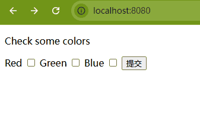

+++
title = "Bind html checkboxes"
date = 2025-03-18T17:00:32+08:00
weight = 30
type = "docs"
description = ""
isCJKLanguage = true
draft = false

+++

> 原文：[https://gin-gonic.com/docs/examples/bind-html-checkbox/](https://gin-gonic.com/docs/examples/bind-html-checkbox/)

## 源码

```go
package main

import (
	"github.com/gin-gonic/gin"
	"net/http"
)

type myForm struct {
	Colors []string `form:"colors[]"`
}

func formHandler(c *gin.Context) {
	var fakeForm myForm
	_ = c.ShouldBind(&fakeForm)
	c.JSON(200, gin.H{"color": fakeForm.Colors})
}

func main() {
	r := gin.Default()
	r.LoadHTMLGlob("templates/*")

	r.GET("/", func(c *gin.Context) {
		// 渲染模板 index.html
		c.HTML(http.StatusOK, "index.html", nil)
	})

	r.POST("/form", formHandler)

	r.Run()
}
```


## 测试

```powershell
PS D:\GoPrjs2\ginOfficeExamples\BindHtmlCheckboxes> curl -F "colors[]=red" -F "colors[]=green" http://localhost:8080/form
{"color":["red","green"]}
PS D:\GoPrjs2\ginOfficeExamples\BindHtmlCheckboxes> curl -F "colors[]=red" -F "colors[]=green" http://localhost:8080/form -i
HTTP/1.1 200 OK
Content-Type: application/json; charset=utf-8
Date: Tue, 18 Mar 2025 09:29:13 GMT
Content-Length: 25

{"color":["red","green"]}
```

## 浏览器测试


